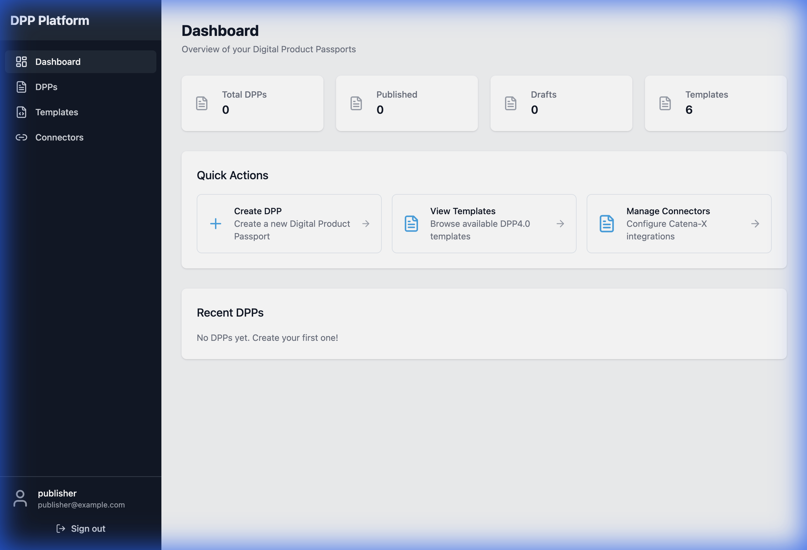
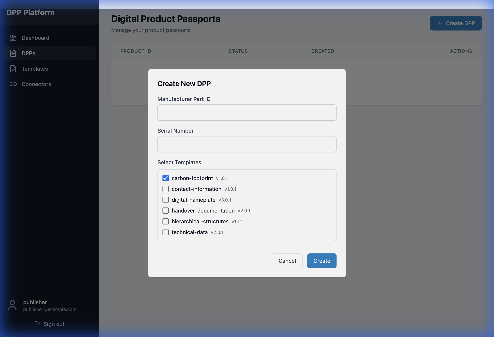
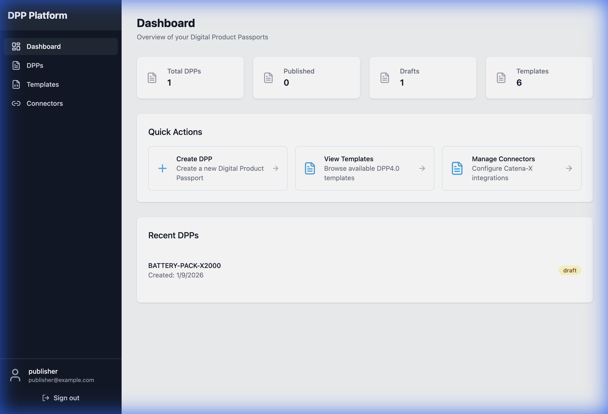
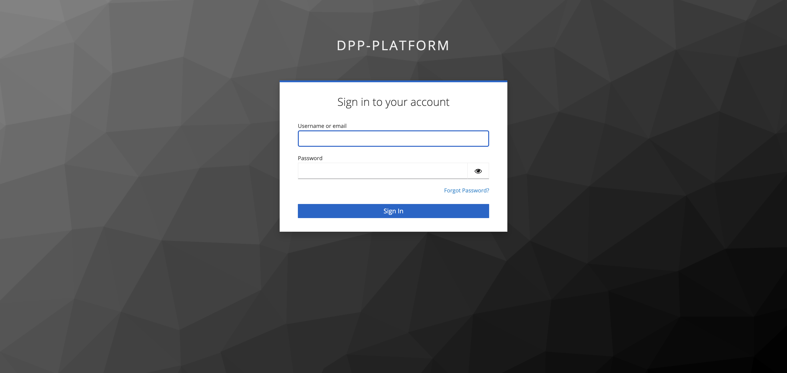
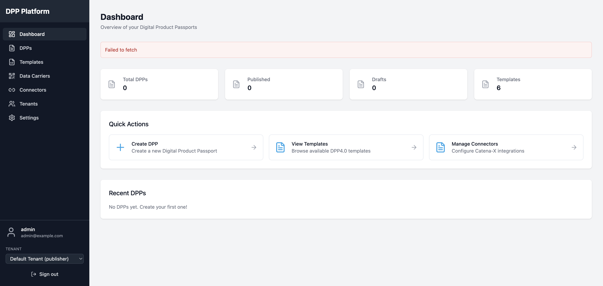
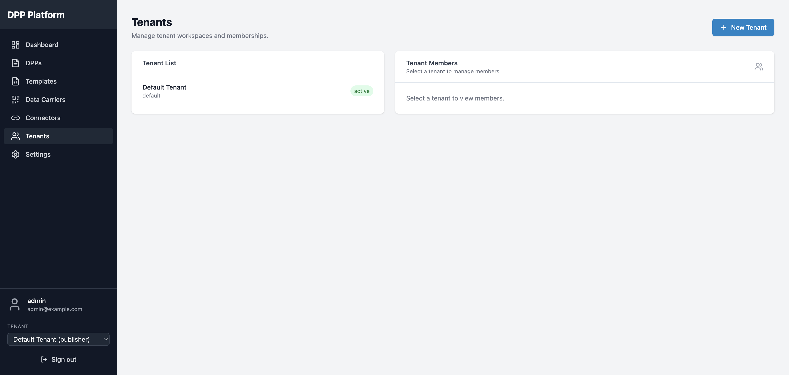
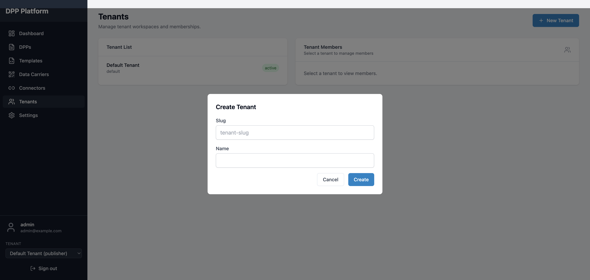
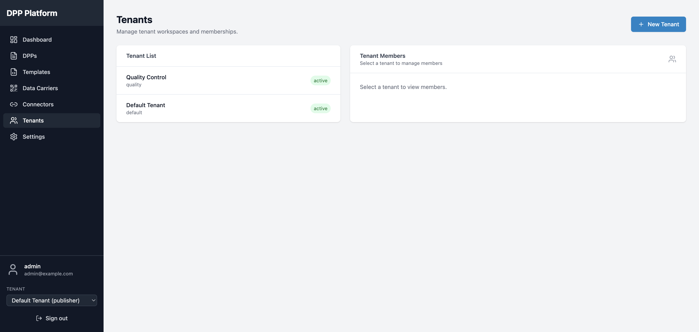
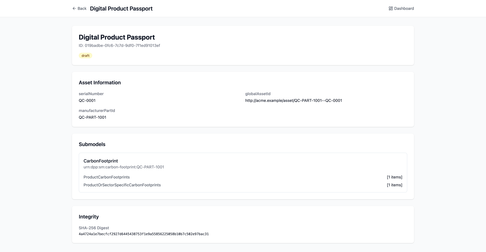

# Mini DPP Platform

[](https://github.com/hadijannat/mini-dpp-platform/actions/workflows/ci.yml)
[](LICENSE)
[](backend/pyproject.toml)
[](frontend/package.json)

> **A production-ready Digital Product Passport (DPP) platform built on Asset Administration Shell (AAS) and IDTA DPP4.0 standards.**

Create, manage, and publish Digital Product Passports compliant with EU regulations. Built with enterprise-grade authentication, authorization, and Catena-X integration.

---

## ✨ Features at a Glance

| Feature | Description |
|---------|-------------|
| 🔐 **OIDC Authentication** | Keycloak-powered secure login with role-based access |
| 📋 **6 IDTA Templates** | Digital Nameplate, Carbon Footprint, Technical Data & more |
| 📦 **DPP Lifecycle** | Create → Edit → Publish → Archive with revision history |
| 🔗 **Catena-X Ready** | DTR publishing with optional EDC DSP endpoint metadata |
| 📤 **Export Formats** | AASX (IDTA Part 5), JSON, and QR code generation |
| 📱 **Data Carriers** | GS1 Digital Link QR codes for EU DPP compliance |
| 🛡️ **ABAC Policies** | Fine-grained access control via Open Policy Agent |

---

## 🚀 Quick Start (5 Minutes)

### Prerequisites
- Docker and Docker Compose installed
- Ports 5173, 8000, 8081, 5432 available

### Start the Platform

```bash
# Clone the repository
git clone https://github.com/hadijannat/mini-dpp-platform.git
cd mini-dpp-platform

# Start all services
docker compose up -d

# Run database migrations (required on first start)
docker exec dpp-backend alembic upgrade head
```

### Access Points

| Service | URL | Credentials |
|---------|-----|-------------|
| 🖥️ **Frontend** | http://localhost:5173 | See below |
| 📡 **API** | http://localhost:8000/api/v1/docs | Bearer token |
| 🔑 **Keycloak Admin** | http://localhost:8081/admin | admin / admin |

### Default Users

| Username | Password | Role | Permissions |
|----------|----------|------|-------------|
| `publisher` | `publisher123` | Publisher | Create & manage DPPs |
| `viewer` | `viewer123` | Viewer | View published DPPs |
| `admin` | `admin123` | Admin | Full administrative access |

---

## 📸 Complete Walkthrough: From Login to Publishing

This section demonstrates the complete workflow for creating and managing a Digital Product Passport.

### Step 1: Landing Page

Navigate to http://localhost:5173 to access the platform.


*The platform uses Keycloak for enterprise-grade OIDC authentication.*

---

### Step 2: Sign In with Keycloak

Click **"Sign in with Keycloak"** and enter your credentials:
- Username: `publisher`
- Password: `publisher123`

---

### Step 3: Dashboard Overview

After login, you'll see the main dashboard with:
- **Statistics**: Total DPPs, Published, Drafts, Templates
- **Quick Actions**: Create DPP, View Templates, Manage Connectors
- **Recent Activity**: Your latest DPPs



*The dashboard provides a complete overview of your Digital Product Passports.*

---

### Step 4: Load IDTA Templates

Navigate to **Templates** in the sidebar. On first use, click **"Refresh All"** to fetch the official IDTA DPP4.0 submodel templates.


*All 6 official IDTA DPP4.0 templates are loaded and ready for use:*
- **Digital Nameplate** - Product identification
- **Contact Information** - Manufacturer contacts
- **Technical Data** - Specifications & performance
- **Carbon Footprint** - Environmental impact data
- **Handover Documentation** - Maintenance & operation docs
- **Hierarchical Structures** - Bill of materials (HSEBoM)

---

### Step 5: Create a Digital Product Passport

Navigate to **DPPs** and click **"+ Create DPP"**.



Fill in the product details:
- **Manufacturer Part ID**: Your product identifier (e.g., `BATTERY-PACK-X2000`)
- **Serial Number**: Unique serial (e.g., `SN-2024-DEMO-001`)
- **Select Templates**: Check the submodels to include


*Select the templates that match your product's compliance requirements.*

---

### Step 6: View Your Created DPP

After creation, your DPP appears in the list with a **"draft"** status.


*The DPP is created with a unique ID and timestamp. Use the action buttons to view, edit, or export.*

---

### Step 7: Edit DPP Submodel Data

Click the **Edit** icon to open the DPP editor. Here you can:
- View asset information
- Edit each submodel's data fields
- Export to JSON, PDF, or AASX format
- **Publish** the DPP when ready


*The editor provides access to all submodel data. Each field follows the IDTA specification.*

**Available Actions:**
| Button | Description |
|--------|-------------|
| Export JSON | Download AAS JSON serialization |
| Export PDF | Generate human-readable document |
| Export AASX | IDTA Part 5 compliant package |
| Publish | Make the DPP publicly available |

---

### Step 8: Configure Catena-X Connectors

Navigate to **Connectors** to set up Digital Twin Registry (DTR) publishing.


**To add a connector:**
1. Click **"Add Connector"**
2. Enter your DTR Base URL
3. Configure authentication (Bearer token)
4. Optionally add EDC DSP endpoint metadata
5. Test the connection

---

### Step 9: Final Dashboard with Stats

After creating DPPs, the dashboard reflects your activity:



*Your dashboard now shows 1 Total DPP, 1 Draft, and 6 loaded Templates.*

---

### Step 10: Generate Data Carriers (QR Codes)

Navigate to **Data Carriers** in the sidebar to generate QR codes for product identification.


**Features:**
- **Standard QR** - Encodes DPP viewer URL
- **GS1 Digital Link** - EU DPP compliant format: `https://id.gs1.org/01/{GTIN}/21/{serial}`
- **Customizable** - Size, colors, and product ID text

---

## 🔧 Admin Walkthrough: Change Global Asset ID Prefix

This walkthrough shows how an **admin** can change the HTTP prefix for global asset IDs (e.g., from `http://example.org/asset/*` to a custom domain).

### Admin Step 1: Open Settings

Sign in as an admin and open **Settings** from the left navigation.


---

### Admin Step 2: Enter Your Custom Prefix

Set the **Global Asset ID Base URI**. Rules enforced by the platform:
- Must start with `http://`
- Must end with `/`
- Must not include a query string or fragment


---

### Admin Step 3: Save and Verify

Click **Save changes** and confirm the success message. Newly created DPPs will use this prefix for their global asset IDs.


- **Export Formats** - PNG, SVG, or print-ready PDF

**GS1 Digital Link Example:**
```
https://id.gs1.org/01/03772280965805/21/SN-2024-DEMO-001
```

> **Note:** QR codes can only be generated for **published** DPPs.

---

## 🧭 Multi‑Tenant Walkthrough (Docker Demo)

This walkthrough uses the local Docker stack with **two tenants**: `default` and `quality`.
Log in as **admin** to create the tenant and assign a **publisher**, then log in as **publisher**
to create a tenant‑scoped DPP and view it at a tenant URL.

### Step 1: Open the Login Page


### Step 2: Authenticate with Keycloak


### Step 3: Admin Dashboard (platform admin)


### Step 4: Open Tenants


### Step 5: Create the `quality` Tenant


### Step 6: Confirm Both Tenants


### Step 7: Add Publisher Membership to `quality`
Use the **publisher user subject (OIDC sub)** when adding members.


### Step 8: Switch to `quality` as Publisher


### Step 9: Create a DPP in `quality`


### Step 10: Verify DPP List is Tenant‑Scoped


### Step 11: Open the Tenant Viewer Route
Example route: `/t/quality/dpp/{dpp_id}`


---

## 🎬 Video Walkthrough

For a complete animated demonstration of the workflow:


---

## 🛠️ Tech Stack

### Backend
- **Python 3.12+** with FastAPI
- **SQLAlchemy 2.0** (async) with PostgreSQL
- **Redis** for caching
- **Keycloak** for OIDC
- **OPA** for ABAC policies

### Frontend
- **React 18+** with TypeScript
- **Vite** build tool
- **TailwindCSS** for styling
- **React Query** for data fetching

### Infrastructure
- Docker Compose orchestration
- PostgreSQL 16 database
- Redis 7 cache
- MinIO S3-compatible storage

---

## 📡 API Usage

### Get Access Token

```bash
TOKEN=$(curl -s -X POST "http://localhost:8081/realms/dpp-platform/protocol/openid-connect/token" \
  -d "client_id=dpp-backend" \
  -d "client_secret=backend-secret-dev" \
  -d "username=publisher" \
  -d "password=publisher123" \
  -d "grant_type=password" | jq -r '.access_token')
```

Default roles: `viewer`, `publisher`, `tenant_admin`, `admin` (platform).

### Optional: Provision Keycloak tenant groups

Tenant membership is managed in the platform database via `/api/v1/tenants/{tenant}/members`.
If you also want Keycloak group scaffolding (one group per tenant with role subgroups),
you can run the provisioning script:

```bash
KEYCLOAK_ADMIN_PASSWORD=admin TENANTS="default,quality" \
  ./infra/keycloak/scripts/provision-tenants.sh
```

This creates groups like `tenant:default` with `viewer`, `publisher`, and `tenant_admin`
subgroups and maps the realm roles.

### Create a DPP via API

> Tenant-scoped APIs use `/api/v1/tenants/{tenant}`. The default tenant slug is `default`.
> The UI reads the tenant slug from local storage (or `VITE_DEFAULT_TENANT`).

```bash
curl -X POST "http://localhost:8000/api/v1/tenants/default/dpps" \
  -H "Authorization: Bearer $TOKEN" \
  -H "Content-Type: application/json" \
  -d '{
    "asset_ids": {
      "manufacturerPartId": "MOTOR-DRIVE-3000",
      "serialNumber": "SN-2024-API-001"
    },
    "selected_templates": ["digital-nameplate", "technical-data"]
  }'
```

### Publish a DPP

```bash
curl -X POST "http://localhost:8000/api/v1/tenants/default/dpps/{dpp_id}/publish" \
  -H "Authorization: Bearer $TOKEN"
```

### Export as AASX

```bash
curl -O -H "Authorization: Bearer $TOKEN" \
  "http://localhost:8000/api/v1/tenants/default/export/{dpp_id}/aasx"
```

---

## 📁 Project Structure

```
mini-dpp-platform/
├── backend/
│   ├── app/
│   │   ├── core/           # Config, logging, security
│   │   ├── db/             # Models, migrations
│   │   └── modules/        # Feature modules
│   │       ├── templates/  # IDTA template registry
│   │       ├── dpps/       # DPP lifecycle management
│   │       ├── export/     # AASX/JSON export
│   │       ├── qr/         # QR code generation
│   │       └── connectors/ # Catena-X integration
│   └── tests/
├── frontend/
│   └── src/
│       ├── features/       # Feature modules
│       └── components/     # Shared UI components
├── infra/
│   ├── keycloak/          # Realm configuration
│   └── opa/               # ABAC policies
└── docker-compose.yml
```

---

## 🔧 Troubleshooting

### "Templates not loading" / `UndefinedTableError`

**Cause:** Database migrations haven't been run.

**Solution:**
```bash
docker exec dpp-backend alembic upgrade head
```

### Login credentials not working

**Cause:** Keycloak might have stale data from a previous installation.

**Solution:**
```bash
docker compose down -v  # Remove volumes
docker compose up -d    # Fresh start
docker exec dpp-backend alembic upgrade head  # Run migrations
```

### Port conflicts

**Solution:** Set custom ports in `.env`:
```bash
cp .env.example .env
# Edit KEYCLOAK_HOST_PORT, BACKEND_HOST_PORT as needed
```

---

## 📋 API Endpoints Reference

### Tenants
| Method | Endpoint | Description |
|--------|----------|-------------|
| GET | `/api/v1/tenants/mine` | List my tenants |
| GET | `/api/v1/tenants` | List all tenants (platform admin) |
| POST | `/api/v1/tenants` | Create tenant (platform admin) |
| GET | `/api/v1/tenants/{tenant}` | Get tenant details |
| GET | `/api/v1/tenants/{tenant}/members` | List tenant members |
| POST | `/api/v1/tenants/{tenant}/members` | Add tenant member |
| DELETE | `/api/v1/tenants/{tenant}/members/{user_subject}` | Remove tenant member |

### Templates
| Method | Endpoint | Description |
|--------|----------|-------------|
| GET | `/api/v1/templates` | List all templates |
| GET | `/api/v1/templates/{key}` | Get template details |
| POST | `/api/v1/templates/refresh` | Refresh from IDTA |

### DPPs
| Method | Endpoint | Description |
|--------|----------|-------------|
| POST | `/api/v1/tenants/{tenant}/dpps` | Create new DPP |
| GET | `/api/v1/tenants/{tenant}/dpps` | List all DPPs |
| GET | `/api/v1/tenants/{tenant}/dpps/{id}` | Get DPP details |
| PUT | `/api/v1/tenants/{tenant}/dpps/{id}/submodel` | Update submodel data |
| POST | `/api/v1/tenants/{tenant}/dpps/{id}/publish` | Publish DPP |

### Export & Data Carriers
| Method | Endpoint | Description |
|--------|----------|-------------|
| GET | `/api/v1/tenants/{tenant}/export/{id}/aasx` | Export as AASX |
| GET | `/api/v1/tenants/{tenant}/export/{id}/json` | Export as JSON |
| GET | `/api/v1/tenants/{tenant}/qr/{id}` | Generate basic QR code |
| POST | `/api/v1/tenants/{tenant}/qr/{id}/carrier` | Generate custom data carrier |
| GET | `/api/v1/tenants/{tenant}/qr/{id}/gs1` | Get GS1 Digital Link URL |

---

## 📜 Standards Compliance

This platform implements:
- **IDTA 01001/01002**: AAS Metamodel & API
- **IDTA 01005**: AASX Package Format
- **IDTA 02006**: Digital Nameplate
- **IDTA 02023**: Carbon Footprint
- **DPP4.0**: Digital Product Passport Templates
- **EU ESPR**: Battery Passport requirements

---

## 📄 License

MIT License - see [LICENSE](LICENSE) for details.

---

## 🤝 Contributing

1. Fork the repository
2. Create a feature branch
3. Run tests: `cd backend && uv run pytest`
4. Submit a pull request

---

<p align="center">
  <strong>Built for the circular economy 🌱</strong>
</p>
