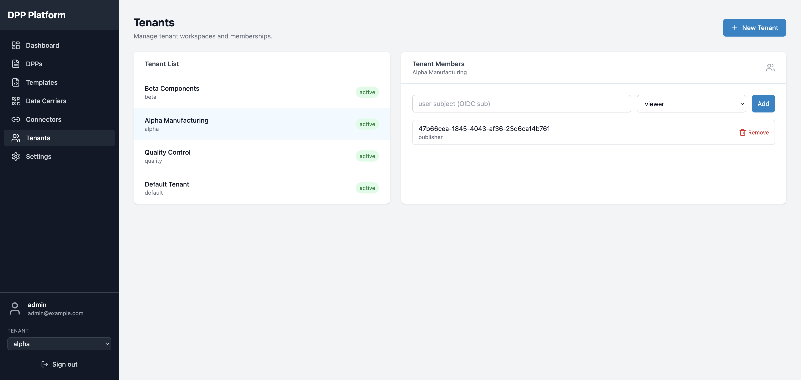
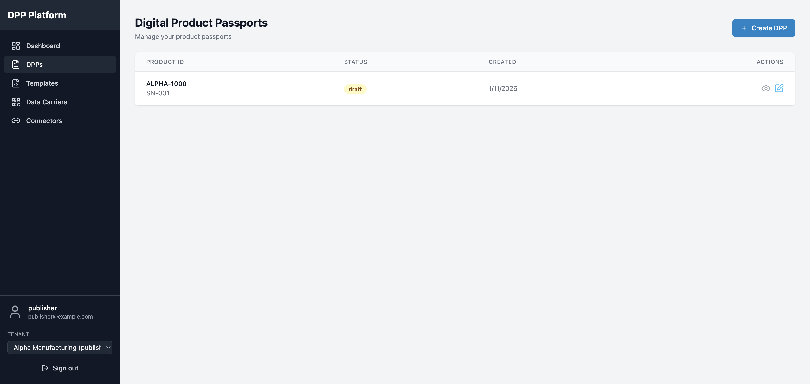
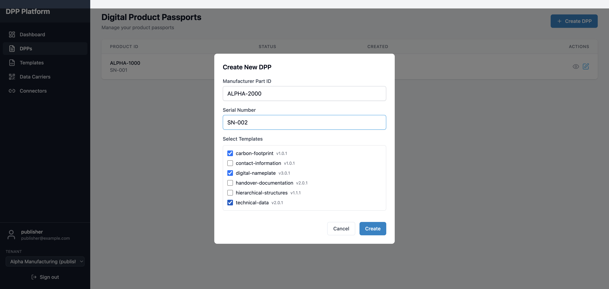
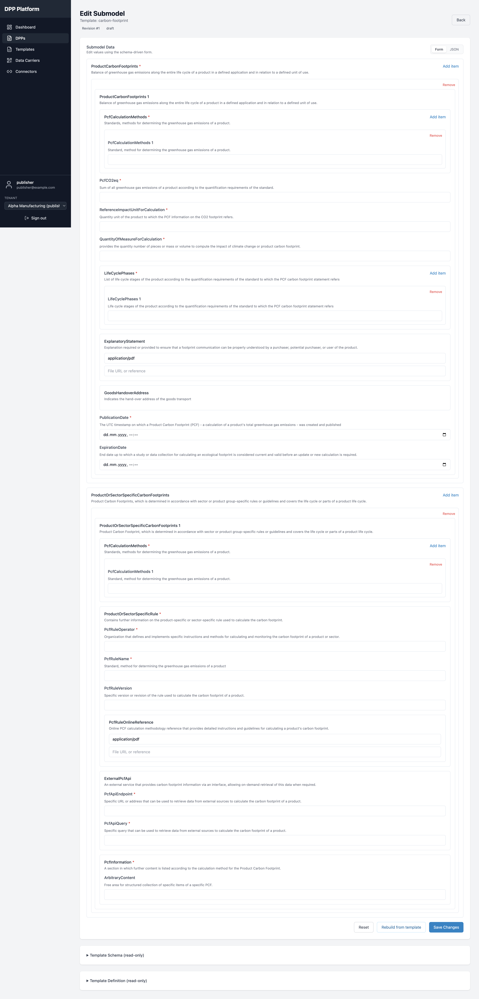

# Mini DPP Platform

[](https://github.com/hadijannat/mini-dpp-platform/actions/workflows/ci.yml)
[](LICENSE)
[](backend/pyproject.toml)
[](frontend/package.json)
[](https://github.com/eclipse-basyx/basyx-python-sdk)
[](https://industrialdigitaltwin.org/)
[](https://industrialdigitaltwin.org/)

> **A Digital Product Passport (DPP) platform built on Asset Administration Shell (AAS) and IDTA DPP4.0 standards.**

Create, manage, and publish Digital Product Passports with Keycloak auth, multi-tenant support, dynamic forms, and AASX/JSON exports.

---

## Tech Stack

| Layer | Technology |
|-------|-----------|
| AAS Engine | [BaSyx Python SDK 2.0.0](https://github.com/eclipse-basyx/basyx-python-sdk) |
| Backend | FastAPI, SQLAlchemy 2.0 (async), Pydantic v2 |
| Frontend | React 18, TanStack Query, React Hook Form, shadcn/ui |
| Auth | Keycloak (OIDC) + OPA (ABAC) |
| Database | PostgreSQL 16, Redis 7 |
| Storage | MinIO (S3-compatible) |
| CI/CD | GitHub Actions, GHCR, Trivy, Bandit |

---

## Highlights

- **AAS & BaSyx Aligned** — BaSyx Python SDK 2.0.0 with AASX compliance validation (round-trip serialization checks)
- **Auth + Access Control** — Keycloak OIDC + OPA ABAC policies with tenant-scoped authorization
- **Multi-tenant** — tenant-scoped APIs, UI switcher, `tenant_admin` role
- **Dynamic Forms** — UI generated from IDTA Submodel Templates with qualifier enforcement
- **DPP Lifecycle** — Draft → Edit → Publish → Archive with revision history
- **DPP Masters** — product-level masters with placeholders, versioning, and `latest` alias
- **JSON Import** — one-shot import from released master templates with validation
- **Catena-X Ready** — DTR publishing with optional EDC metadata
- **Export** — AASX (IDTA Part 5), JSON, QR codes, and GS1 Digital Link
- **Public DPP Viewer** — unauthenticated viewer with EU ESPR compliance categories
- **Field-level Encryption** — Fernet encryption for sensitive DPP values
- **Audit Logging** — structured audit events for all CRUD, export, and publish operations
- **Rate Limiting** — Redis-backed per-IP + per-user throttling (fails open when Redis unavailable)

---

## Quick Start (Docker)

### Prerequisites
- Docker + Docker Compose
- Ports: `5173`, `8001`, `8081`, `5432`

### Start the stack

```bash
git clone https://github.com/hadijannat/mini-dpp-platform.git
cd mini-dpp-platform

docker compose up -d

# Run database migrations (first start)
docker exec dpp-backend alembic upgrade head
```

### Access points

| Service | URL | Notes |
|---------|-----|-------|
| Frontend | http://localhost:5173 | UI (tenant aware) |
| API Docs | http://localhost:8001/api/v1/docs | Swagger UI (or `BACKEND_HOST_PORT` from `.env`) |
| Keycloak | http://localhost:8081/admin | admin / admin |

### Default users

| Username | Password | Role | Notes |
|----------|----------|------|------|
| `admin` | `admin123` | platform admin | Full platform access |
| `publisher` | `publisher123` | publisher | Create/manage DPPs |
| `viewer` | `viewer123` | viewer | View published DPPs |

> `tenant_admin` is a tenant-scoped role you can assign via tenant membership.

### Dockerized UI notes (Playwright/E2E)

When the UI is accessed from another container (for example Playwright running in Docker),
the frontend switches to internal service URLs if they are provided:

- `VITE_API_BASE_URL_INTERNAL=http://backend:8000`
- `VITE_KEYCLOAK_URL_INTERNAL=http://keycloak:8080`

`docker-compose.yml` sets these for the frontend container.

### Dev convenience

In **development** mode only, users who access the `default` tenant and are not yet
members are auto-added to that tenant with a role inferred from their realm roles
(`publisher` → tenant publisher, otherwise viewer).

---

## Walkthrough

### Multi-tenant Demo (Docker)

Create two tenants (`alpha` and `beta`) as admin, assign publisher to `alpha`, then build a tenant-scoped DPP.

<details>
<summary>View all steps (11 screenshots)</summary>

| Step | Screenshot |
|------|------------|
| 1. Login page |  |
| 2. Keycloak sign-in |  |
| 3. Admin dashboard |  |
| 4. Tenants list |  |
| 5. Create tenants |  |
| 6. Add publisher to `alpha` (use OIDC sub) |  |
| 7. Switch to `alpha` as publisher |  |
| 8. Create DPP in `alpha` |  |
| 9. DPP list for `alpha` |  |
| 10. `beta` is empty |  |
| 11. Viewer route (`/t/alpha/dpp/{id}`) |  |

</details>

---

### Dynamic Forms Demo

Templates generate the UI. Select templates, create a DPP, and edit each submodel with its generated form.

<details>
<summary>View all steps (5 screenshots)</summary>

| Step | Screenshot |
|------|------------|
| 12. Select templates |  |
| 13. DPP in list |  |
| 14. Submodel edit links |  |
| 15. Carbon Footprint form |  |
| 16. Nameplate form |  |

</details>

---

### Admin: Global Asset ID Prefix

Change the HTTP prefix used for global asset IDs (e.g., `https://example.com/asset/*`).

**Step A:** Open Settings


**Step B:** Edit the prefix (must start with `http://` and end with `/`)


**Step C:** Save and verify


---

### Data Carriers (QR / GS1 Digital Link)


- Standard QR encodes the viewer URL
- GS1 Digital Link format: `https://id.gs1.org/01/{GTIN}/21/{serial}`
- QR generation is available for **published** DPPs

---

## How Dynamic Forms Work

- Templates are fetched from the **IDTA Submodel Template repository** and cached
- The backend parses templates and generates:
  - A **definition tree** (submodel structure)
  - A **JSON schema** for UI rendering
- The frontend renders each submodel dynamically and enforces template qualifiers
  (cardinality, allowed ranges, read-only, required languages, etc.)

---

## API Usage

### Get access token

```bash
TOKEN=$(curl -s -X POST "http://localhost:8081/realms/dpp-platform/protocol/openid-connect/token" \
  -d "client_id=dpp-backend" \
  -d "client_secret=backend-secret-dev" \
  -d "username=publisher" \
  -d "password=publisher123" \
  -d "grant_type=password" | jq -r '.access_token')
```

### Refresh templates (IDTA)

```bash
curl -X POST "http://localhost:8001/api/v1/templates/refresh" \
  -H "Authorization: Bearer $TOKEN"
```

### Create a DPP

> Tenant APIs use `/api/v1/tenants/{tenant}`. Default tenant: `default`.

```bash
curl -X POST "http://localhost:8001/api/v1/tenants/default/dpps" \
  -H "Authorization: Bearer $TOKEN" \
  -H "Content-Type: application/json" \
  -d '{
    "asset_ids": {
      "manufacturerPartId": "MOTOR-DRIVE-3000",
      "serialNumber": "SN-2024-API-001"
    },
    "selected_templates": ["digital-nameplate", "technical-data"]
  }'
```

### DPP Masters: fetch released template + variables

```bash
curl -X GET "http://localhost:8001/api/v1/tenants/default/masters/by-product/MOTOR-DRIVE-3000/versions/latest/template" \
  -H "Authorization: Bearer $TOKEN"

curl -X GET "http://localhost:8001/api/v1/tenants/default/masters/by-product/MOTOR-DRIVE-3000/versions/latest/variables" \
  -H "Authorization: Bearer $TOKEN"

# Optional: fetch raw template string (text/plain)
curl -X GET "http://localhost:8001/api/v1/tenants/default/masters/by-product/MOTOR-DRIVE-3000/versions/latest/template/raw" \
  -H "Authorization: Bearer $TOKEN"

# Validate a filled template payload without creating a DPP
curl -X POST "http://localhost:8001/api/v1/tenants/default/masters/by-product/MOTOR-DRIVE-3000/versions/latest/validate" \
  -H "Authorization: Bearer $TOKEN" \
  -H "Content-Type: application/json" \
  -d @filled-template.json
```

### Import a DPP from a master template (single shot)

```bash
curl -X POST "http://localhost:8001/api/v1/tenants/default/dpps/import?master_product_id=MOTOR-DRIVE-3000&master_version=latest" \
  -H "Authorization: Bearer $TOKEN" \
  -H "Content-Type: application/json" \
  -d @filled-template.json
```

> If a DPP already exists for the same `manufacturerPartId` + `serialNumber`,
> the API returns `409 Conflict` with the existing `dpp_id`.
> If placeholders are still present or required values are missing, the API
> returns `422` with a structured `errors` array (code, name, path).

> The UI includes an import panel to load a released master and fill placeholders.

### Publish a DPP

```bash
curl -X POST "http://localhost:8001/api/v1/tenants/default/dpps/{dpp_id}/publish" \
  -H "Authorization: Bearer $TOKEN"
```

### Export as AASX

```bash
curl -O -H "Authorization: Bearer $TOKEN" \
  "http://localhost:8001/api/v1/tenants/default/export/{dpp_id}/aasx"
```

---

## Template Diagnostics

Generate a conformance report (schema coverage + qualifier support):

```bash
docker compose exec -T backend python -m app.modules.templates.diagnostics > /tmp/template-report.json
```

---

## Template Goldens (Snapshots)

Golden files lock the **template definition + schema** hashes so we can detect
unexpected changes in dynamic form generation.

### Update goldens

```bash
docker compose up -d
docker exec dpp-backend alembic upgrade head

# Backend runs on 8001 in docker-compose by default
cd backend
DPP_BASE_URL=http://localhost:8001 uv run python -m tests.tools.update_template_goldens
```

### Run golden checks

```bash
cd backend
RUN_E2E=1 RUN_GOLDENS=1 DPP_BASE_URL=http://localhost:8001 KEYCLOAK_BASE_URL=http://localhost:8081 \
  uv run pytest -m golden --run-e2e --run-goldens
```

---

## API Endpoints (Summary)

### Tenants
| Method | Endpoint | Description |
|--------|----------|-------------|
| GET | `/api/v1/tenants/mine` | List my tenants |
| GET | `/api/v1/tenants` | List all tenants (platform admin) |
| POST | `/api/v1/tenants` | Create tenant (platform admin) |
| GET | `/api/v1/tenants/{tenant}` | Get tenant details |
| GET | `/api/v1/tenants/{tenant}/members` | List tenant members |
| POST | `/api/v1/tenants/{tenant}/members` | Add tenant member |
| DELETE | `/api/v1/tenants/{tenant}/members/{user_subject}` | Remove tenant member |

### Templates
| Method | Endpoint | Description |
|--------|----------|-------------|
| GET | `/api/v1/templates` | List templates |
| GET | `/api/v1/templates/{key}` | Template metadata |
| GET | `/api/v1/templates/{key}/definition` | Template definition |
| GET | `/api/v1/templates/{key}/schema` | Template UI schema |
| POST | `/api/v1/templates/refresh` | Refresh all templates |
| POST | `/api/v1/templates/refresh/{key}` | Refresh a single template |

### DPPs
| Method | Endpoint | Description |
|--------|----------|-------------|
| POST | `/api/v1/tenants/{tenant}/dpps` | Create DPP |
| POST | `/api/v1/tenants/{tenant}/dpps/import` | Import DPP from filled AAS JSON |
| GET | `/api/v1/tenants/{tenant}/dpps` | List DPPs |
| GET | `/api/v1/tenants/{tenant}/dpps/{id}` | Get DPP |
| PUT | `/api/v1/tenants/{tenant}/dpps/{id}/submodel` | Update submodel data |
| POST | `/api/v1/tenants/{tenant}/dpps/{id}/publish` | Publish DPP |

### DPP Masters
| Method | Endpoint | Description |
|--------|----------|-------------|
| GET | `/api/v1/tenants/{tenant}/masters` | List master templates |
| POST | `/api/v1/tenants/{tenant}/masters` | Create master template |
| GET | `/api/v1/tenants/{tenant}/masters/{id}` | Get master template |
| PATCH | `/api/v1/tenants/{tenant}/masters/{id}` | Update master template |
| GET | `/api/v1/tenants/{tenant}/masters/{id}/versions` | List master versions |
| POST | `/api/v1/tenants/{tenant}/masters/{id}/versions` | Release master version |
| PATCH | `/api/v1/tenants/{tenant}/masters/{id}/versions/{version}/aliases` | Update version aliases |
| GET | `/api/v1/tenants/{tenant}/masters/by-product/{productId}/versions/{version}/template` | Get released template package |
| GET | `/api/v1/tenants/{tenant}/masters/by-product/{productId}/versions/{version}/template/raw` | Get raw template string |
| GET | `/api/v1/tenants/{tenant}/masters/by-product/{productId}/versions/{version}/variables` | Get released variables |
| POST | `/api/v1/tenants/{tenant}/masters/by-product/{productId}/versions/{version}/validate` | Validate filled payload |

### Export & Data Carriers
| Method | Endpoint | Description |
|--------|----------|-------------|
| GET | `/api/v1/tenants/{tenant}/export/{id}/aasx` | Export AASX |
| GET | `/api/v1/tenants/{tenant}/export/{id}/json` | Export JSON |
| GET | `/api/v1/tenants/{tenant}/qr/{id}` | Basic QR code |
| POST | `/api/v1/tenants/{tenant}/qr/{id}/carrier` | Custom data carrier |
| GET | `/api/v1/tenants/{tenant}/qr/{id}/gs1` | GS1 Digital Link URL |

---

## Project Structure

```
mini-dpp-platform/
├── backend/
│   ├── app/
│   │   ├── core/               # Config, logging, security
│   │   │   ├── audit.py        # Structured audit event logging
│   │   │   ├── config.py       # Pydantic-settings with production validators
│   │   │   ├── encryption.py   # Fernet field-level encryption
│   │   │   ├── middleware.py    # Security headers (CSP, HSTS)
│   │   │   ├── rate_limit.py   # Redis-backed rate limiting
│   │   │   └── security/       # JWT validation, OIDC
│   │   ├── db/                 # Models, Alembic migrations, async sessions
│   │   └── modules/
│   │       ├── aas/            # Shared BaSyx utilities (references, traversal, cloning)
│   │       ├── templates/      # IDTA template registry + diagnostics
│   │       ├── dpps/           # DPP lifecycle + public viewer router
│   │       ├── masters/        # DPP masters (versioning, placeholders)
│   │       ├── export/         # AASX/JSON export (IDTA Part 5)
│   │       ├── qr/             # QR code + GS1 Digital Link generation
│   │       ├── connectors/     # Catena-X DTR integration
│   │       ├── policies/       # OPA ABAC authorization
│   │       ├── tenants/        # Tenant management + membership
│   │       └── settings/       # Platform settings (asset ID prefix, etc.)
│   └── tests/
├── frontend/
│   └── src/
│       ├── features/
│       │   ├── admin/          # Admin dashboard, tenants, settings
│       │   ├── editor/         # Dynamic AAS form editor
│       │   ├── publisher/      # DPP management, masters, import
│       │   ├── viewer/         # Public DPP viewer (EU ESPR categories)
│       │   └── connectors/     # Catena-X DTR UI
│       └── components/         # Shared UI components (shadcn/ui primitives)
├── infra/
│   ├── keycloak/               # Realm configuration
│   └── opa/                    # ABAC policies (Rego)
└── docker-compose.yml
```

---

## Standards Alignment

| Standard | Description | Usage |
|----------|-------------|-------|
| [Eclipse BaSyx Python SDK 2.0.0](https://github.com/eclipse-basyx/basyx-python-sdk) | AAS reference implementation | Object model, serialization, compliance validation |
| [IDTA 01001 / 01002](https://industrialdigitaltwin.org/content-hub/aasspecifications) | AAS metamodel (Part 1 & 2) | Core data model for submodels and elements |
| [IDTA 01005](https://industrialdigitaltwin.org/content-hub/aasspecifications) | AASX package format (Part 5) | Export packaging |
| [IDTA DPP4.0](https://industrialdigitaltwin.org/content-hub/submodels) | Digital Product Passport templates | 6 templates: Nameplate, Technical Data, Carbon Footprint, BOM, Handover Documentation, Hierarchical Structures |
| [IEC 61360](https://www.iec.ch/dyn/www/f?p=103:7:::::FSP_ORG_ID:1452) | Concept description data specifications | Property definitions and value formats |
| [GS1 Digital Link](https://www.gs1.org/standards/gs1-digital-link) | URI-based product identification | QR code data carriers |
| [EU ESPR](https://environment.ec.europa.eu/topics/circular-economy/digital-product-passport_en) | European Sustainability & Product Regulation | Public viewer classification categories |

---

## Engineering Playbooks

- Multi-agent orchestration and inspection workflow docs: [`docs/agent-teams/README.md`](docs/agent-teams/README.md)

---

## Troubleshooting

### Templates not loading / `UndefinedTableError`
**Cause:** Database migrations haven't been run.

```bash
docker exec dpp-backend alembic upgrade head
```

### Login credentials not working
**Cause:** Keycloak might have stale data from a previous installation.

```bash
docker compose down -v
docker compose up -d
docker exec dpp-backend alembic upgrade head
```

### Port conflicts
Set custom ports in `.env`:

```bash
cp .env.example .env
# Edit KEYCLOAK_HOST_PORT, BACKEND_HOST_PORT as needed
```

---

## Contributing

1. Fork the repository
2. Create a feature branch
3. Run tests: `cd backend && uv run pytest`
4. Submit a pull request

---

## License

MIT License — see [LICENSE](LICENSE) for details.
