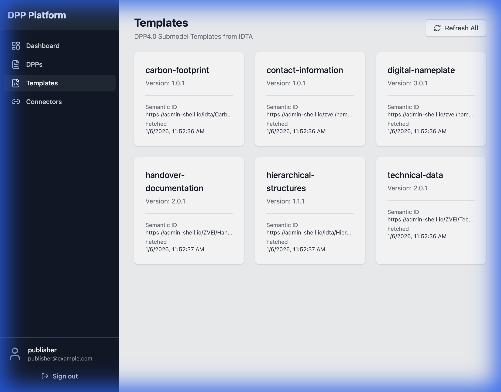
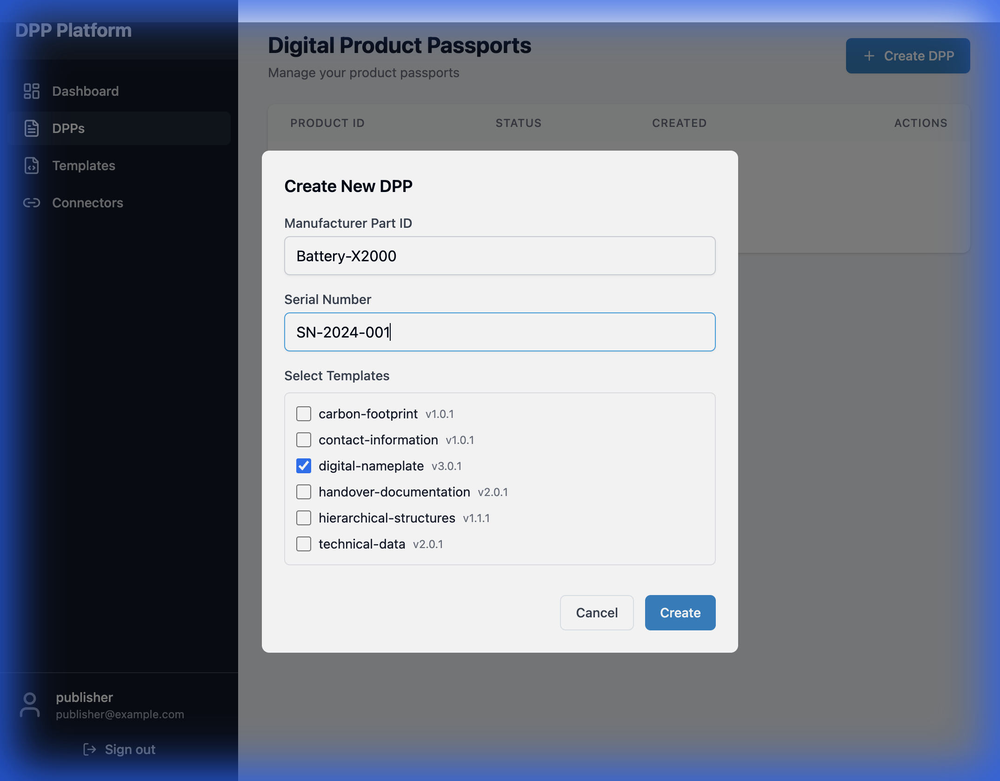
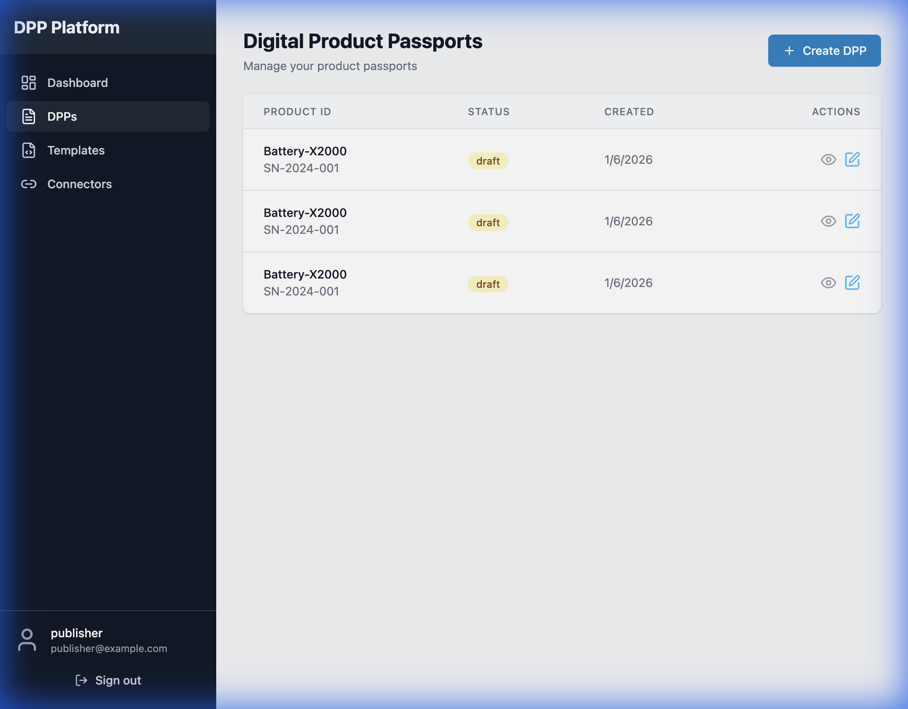
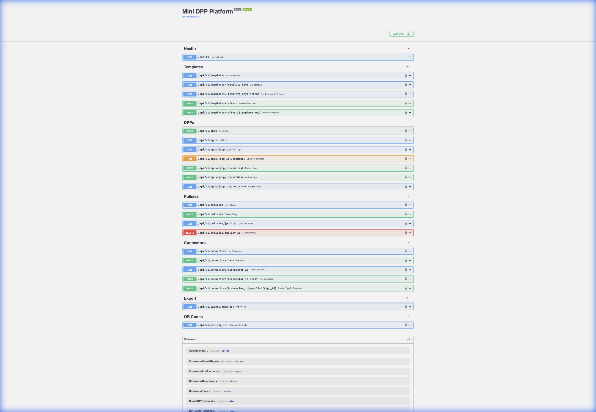

# Mini DPP Platform

[](https://github.com/hadijannat/mini-dpp-platform/actions/workflows/ci.yml)
[](LICENSE)
[](backend/pyproject.toml)
[](frontend/package.json)

A Digital Product Passport (DPP) management platform based on the Asset Administration Shell (AAS) and IDTA DPP4.0 standards.

## 📸 Screenshots

### Dashboard

*Dashboard showing DPP counts, template statistics, and recent activity*

### Template Registry

*All 6 IDTA DPP4.0 submodel templates loaded and ready for use*

### DPP Creation

*Creating a new DPP with template selection*

### DPP Management

*Managing created DPPs with status tracking and edit capabilities*

### Connector Configuration

*Adding a new Catena-X DTR connector with authentication settings*

### Connector Management

*Managing connectors with status and connectivity testing*

### API Documentation

*Interactive API documentation with all available endpoints*

---

## Features

- **DPP Lifecycle Management**: Create, edit, publish, and archive Digital Product Passports
- **IDTA DPP4.0 Templates**: Support for all 6 standard submodel templates:
  - Digital Nameplate
  - Contact Information
  - Technical Data
  - Carbon Footprint
  - Handover Documentation
  - Hierarchical Structures
- **OIDC Authentication**: Keycloak integration for secure authentication
- **ABAC Authorization**: Open Policy Agent (OPA) for fine-grained access control
- **Catena-X Integration**: DTR (Digital Twin Registry) publishing with optional EDC DSP endpoint metadata
- **Export Formats**: AASX (IDTA Part 5 compliant) and JSON export
- **QR Code Generation**: Product identification via QR codes

## Tech Stack

### Backend
- Python 3.12+ with FastAPI
- SQLAlchemy 2.0 (async) with PostgreSQL
- Redis for caching
- Keycloak for OIDC
- OPA for ABAC policies

### Frontend
- React 18+ with TypeScript
- Vite build tool
- TailwindCSS
- React Query
- React Hook Form

### Infrastructure
- Docker Compose for local development
- PostgreSQL 16
- Redis 7
- Keycloak 24
- OPA (Open Policy Agent)
- MinIO (S3-compatible storage)

## Quick Start

### Prerequisites
- Docker and Docker Compose
- Node.js 20+ (for frontend development)
- Python 3.12+ with uv (for backend development)

### Running with Docker Compose

```bash
# Start all services
docker compose up -d

# View logs
docker compose logs -f

# Stop services
docker compose down
```

### Service URLs
| Service | URL |
|---------|-----|
| Frontend | http://localhost:5173 |
| Backend API | http://localhost:8000 |
| API Documentation | http://localhost:8000/api/v1/docs |
| Keycloak Admin | http://localhost:8080/admin (default: admin/admin) |
| OPA | http://localhost:8181 |

> Port conflicts? Set `KEYCLOAK_HOST_PORT` and/or `BACKEND_HOST_PORT` in `.env` to override
> the defaults and adjust the URLs above accordingly.

> Note: Keycloak admin credentials are set only on the first boot. If the default
> admin login fails, you likely have old volumes from a previous run. In that
> case, reset the data with `docker compose down -v` (this removes all local data),
> then start again with `docker compose up -d`.

To set a custom Keycloak admin password on first boot:

```bash
cp .env.example .env
# edit KEYCLOAK_ADMIN_PASSWORD before starting containers
```

### Default Users
| Username | Password | Role |
|----------|----------|------|
| publisher | publisher123 | Publisher |
| viewer | viewer123 | Viewer |
| admin | admin123 | Admin |

> The app login uses the `dpp-platform` realm users above. These are separate
> from the Keycloak admin console user.

### Initial Setup

After starting the services, you need to load the IDTA templates:

1. Navigate to http://localhost:5173
2. Login with `publisher` / `publisher123`
3. Go to **Templates** page
4. Click **Refresh All** to fetch templates from the IDTA repository
5. You should see 6 templates loaded

> If template refresh fails due to GitHub API rate limits, set
> `IDTA_TEMPLATES_GITHUB_TOKEN` in `.env` and restart the backend.

## Usage

### Creating a Digital Product Passport

1. **Navigate to DPPs**: Click "DPPs" in the sidebar
2. **Create New**: Click the "Create DPP" button
3. **Enter Asset IDs**: Provide Manufacturer Part ID and Serial Number
4. **Select Templates**: Choose which submodel templates to include
5. **Create**: Click "Create" to save the DPP

### Connecting to Catena-X

The platform supports Catena-X Digital Twin Registry (DTR) publishing. If you have an EDC data plane, you can optionally attach its DSP endpoint to submodel descriptor metadata.

1. **Navigate to Connectors**: Click "Connectors" in the sidebar
2. **Add Connector**: Click "Add Connector"
3. **Configure**:
   - **Name**: Friendly name for the connector
   - **DTR Base URL**: Your DTR API endpoint (e.g., `https://dtr.catena-x.net/api/v3`)
   - **Access Token**: Bearer token for DTR authentication
   - **BPN**: Your Business Partner Number (e.g., `BPNL00000001TEST`)
   - **Submodel Base URL**: Public URL where your submodels are exposed
   - **EDC DSP endpoint** (optional): DSP endpoint to include in descriptor metadata
4. **Test Connection**: Click "Test" to verify connectivity
5. **Publish DPPs**: Use the API to publish DPPs to the registry

### API Usage Example

```bash
# If you overrode host ports in .env, replace 8080/8000 accordingly.
# Get an access token
TOKEN=$(curl -s -X POST "http://localhost:8080/realms/dpp-platform/protocol/openid-connect/token" \
  -d "client_id=dpp-backend" \
  -d "client_secret=backend-secret-dev" \
  -d "username=publisher" \
  -d "password=publisher123" \
  -d "grant_type=password" | jq -r '.access_token')

# List templates
curl -H "Authorization: Bearer $TOKEN" http://localhost:8000/api/v1/templates

# Create a DPP
curl -X POST -H "Authorization: Bearer $TOKEN" \
  -H "Content-Type: application/json" \
  http://localhost:8000/api/v1/dpps \
  -d '{
    "asset_ids": {
      "manufacturerPartId": "BATTERY-X2000",
      "serialNumber": "SN-2024-001"
    },
    "selected_templates": ["digital-nameplate", "carbon-footprint"]
  }'

# Publish a DPP
curl -X POST -H "Authorization: Bearer $TOKEN" \
  http://localhost:8000/api/v1/dpps/{dpp_id}/publish
```

## Development

### Backend Development

```bash
cd backend

# Install dependencies
uv sync

# Run migrations
uv run alembic upgrade head

# Start development server
uv run uvicorn app.main:app --reload --port 8000

# Run tests
uv run pytest

# Lint and format
uv run ruff check .
uv run ruff format .
uv run mypy app
```

### Frontend Development

```bash
cd frontend

# Install dependencies
npm install

# Start development server
npm run dev

# Run tests
npm test

# Lint
npm run lint

# Type check
npm run typecheck

# Build for production
npm run build
```

## Release & Security

- Release process: see `docs/RELEASE.md`
- Changelog: `CHANGELOG.md`
- SBOM + vulnerability scans run in the `Security` GitHub Actions workflow

## Project Structure

```
mini-dpp-platform/
├── backend/
│   ├── app/
│   │   ├── core/           # Config, logging, security
│   │   ├── db/             # Models, migrations, session
│   │   └── modules/        # Feature modules
│   │       ├── templates/  # Template registry
│   │       ├── dpps/       # DPP management
│   │       ├── export/     # AASX/JSON export
│   │       ├── qr/         # QR code generation
│   │       ├── policies/   # ABAC policies
│   │       └── connectors/ # External integrations
│   └── tests/
├── frontend/
│   └── src/
│       ├── app/            # Layouts, routing
│       ├── auth/           # Authentication
│       ├── components/     # Shared components
│       └── features/       # Feature modules
├── infra/
│   ├── keycloak/          # Realm configuration
│   ├── opa/               # Policy files
│   └── postgres/          # Init scripts
├── docs/
│   └── images/            # Screenshots and documentation images
└── docker-compose.yml
```

## API Endpoints

### Templates
- `GET /api/v1/templates` - List available templates
- `GET /api/v1/templates/{key}` - Get template details
- `GET /api/v1/templates/{key}/schema` - Get UI schema
- `POST /api/v1/templates/refresh` - Refresh all templates

### DPPs
- `POST /api/v1/dpps` - Create new DPP
- `GET /api/v1/dpps` - List DPPs
- `GET /api/v1/dpps/{id}` - Get DPP details
- `PUT /api/v1/dpps/{id}/submodel` - Update submodel data
- `POST /api/v1/dpps/{id}/publish` - Publish DPP
- `POST /api/v1/dpps/{id}/archive` - Archive DPP
- `GET /api/v1/dpps/{id}/revisions` - List revisions

### Export
- `GET /api/v1/export/{dpp_id}/aasx` - Export as AASX
- `GET /api/v1/export/{dpp_id}/json` - Export as JSON

### QR Codes
- `GET /api/v1/qr/{dpp_id}` - Generate QR code

### Connectors
- `GET /api/v1/connectors` - List connectors
- `POST /api/v1/connectors` - Create connector
- `GET /api/v1/connectors/{id}` - Get connector details
- `POST /api/v1/connectors/{id}/test` - Test connector
- `POST /api/v1/connectors/{id}/publish/{dpp_id}` - Publish DPP to DTR

## Standards Compliance

- **IDTA 01001**: Asset Administration Shell - Part 1: Metamodel
- **IDTA Part 2**: AAS API and JSON serialization
- **IDTA 01005**: Asset Administration Shell - Part 5: AASX Package File Format
- **IDTA 02006**: Digital Nameplate
- **IDTA 02002**: Contact Information
- **IDTA 02003**: Technical Data
- **IDTA 02023**: Carbon Footprint
- **IDTA 02004**: Handover Documentation
- **IDTA 02011**: Hierarchical Structures (HSEBoM)
- **DPP4.0**: Digital Product Passport Submodel Templates

## Troubleshooting

### Common Issues

**Templates not loading**: Ensure the backend can reach external URLs. Check the backend logs:
```bash
docker logs dpp-backend
```

**Login redirect fails**: The Keycloak realm may need `sslRequired: none` for local development. This is already configured in the provided realm export.

**API returns 401**: Ensure your JWT token hasn't expired. Tokens are issued with a short lifespan (5 minutes by default).

**Connector test fails**: Verify the DTR URL is accessible and the authentication token is valid.

## License

MIT License
