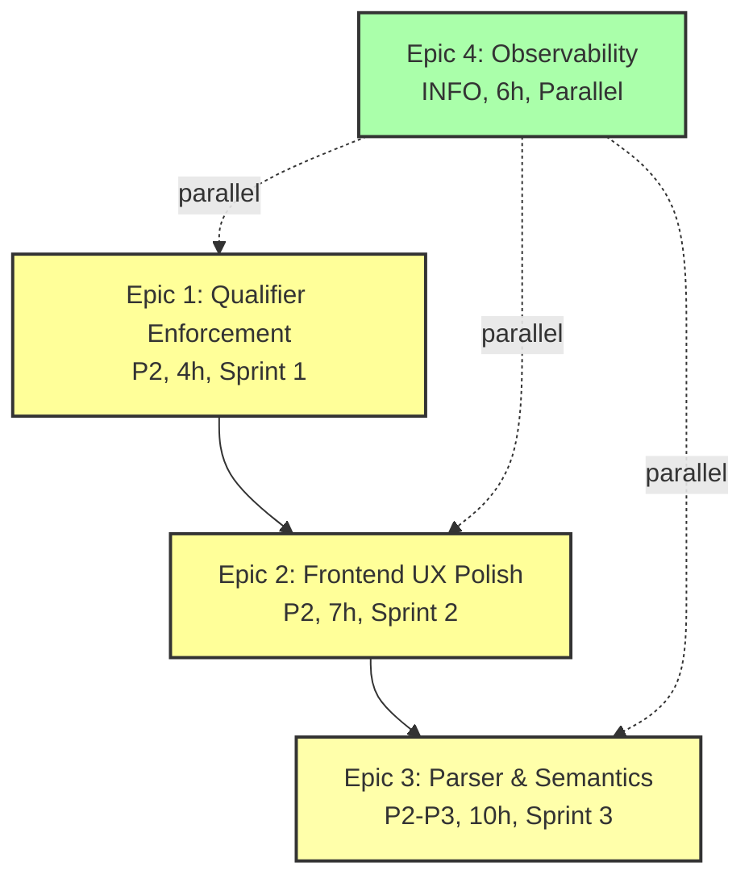
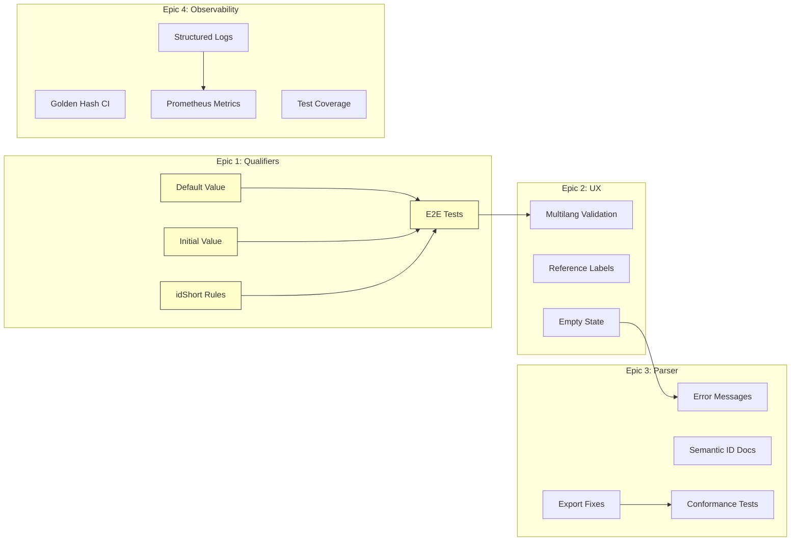

# IDTA Pipeline Inspection - Execution Plan
## Remediation Roadmap: Epics → Stories → Tasks

**Inspection Date**: 2026-02-10
**Planning Horizon**: 6 weeks (3 sprints)
**Total Effort**: 21 hours (across 4 epics)
**Target Alignment**: 99.4% (up from 72.4%)

---

## Executive Summary

The inspection identified **39 findings** across 7 expert reports, with **0 critical** and **0 high** severity issues. All gaps are addressable through incremental improvements with no architectural changes required.

**Prioritization Framework**:
- **P0 (Critical)**: Blocks production deployment - 0 findings
- **P1 (High)**: Degrades user experience significantly - 0 findings
- **P2 (Medium)**: Reduces data quality or UX polish - 8 findings
- **P3 (Low)**: Minor improvements, edge cases - 11 findings
- **INFO**: Observability and documentation - 20 findings

**Strategic Themes**:
1. **Qualifier Completeness** (15% alignment gain) - Close SMT qualifier enforcement gap
2. **Frontend UX** (7% gain) - Polish validation and empty state handling
3. **Parser Robustness** (5% gain) - Improve error messages and semantic ID coverage
4. **Observability** (0% alignment, high operational value) - Enhance logging and metrics

---

## Epic Dependency Graph



**Critical Path**: E1 → E2 → E3 (sequential, 21 hours total)
**Parallel Work**: E4 can run concurrently with all epics (6 hours)

---

## Epic 1: Qualifier Enforcement Completeness

### Epic Metadata

| Field | Value |
|-------|-------|
| **ID** | EPIC-001 |
| **Priority** | P2 (Medium) |
| **Theme** | Qualifier Completeness |
| **Owner Role** | frontend-engineer (Role 4) |
| **Collaborators** | idta-smt-specialist (Role 1) |
| **Sprint** | Sprint 1 (Week 1-2) |
| **Total Effort** | 4 hours (across 4 stories) |
| **Dependencies** | None - can start immediately |
| **Findings Addressed** | FIND-001 (5 missing qualifiers) |
| **Alignment Impact** | +15.2% (35 cells: B3, C3 across 7 templates) |

### Business Value

**Problem**: Platform enforces only 11/15 IDTA-defined SMT qualifier types, reducing semantic fidelity and data quality. Users cannot leverage advanced constraints like default values, idShort naming rules, or initial value hints.

**Impact**:
- **Data Quality**: Missing constraints allow invalid idShorts, inconsistent naming
- **UX**: No default/initial value hints reduce form usability
- **Compliance**: 73% qualifier coverage falls short of full IDTA Part 1a conformance

**Solution**: Implement remaining 5 qualifier types in frontend and Zod schema builder.

### Acceptance Criteria

- [ ] All 15 SMT qualifier types enforced in frontend (100% coverage)
- [ ] Zod schema builder handles all 15 types
- [ ] E2E tests cover each qualifier type with positive and negative cases
- [ ] Frontend documentation updated with qualifier reference table
- [ ] Alignment Matrix cells B3, C3 change from ⚠️ to ✅ for all 7 templates

### Target Paths

```
frontend/src/features/editor/
├── components/fields/PropertyField.tsx      # default_value, initial_value
├── components/fields/EnumField.tsx          # default_value
├── utils/zodSchemaBuilder.ts                # All 5 types
└── hooks/useSubmodelForm.ts                 # initial_value application

backend/app/modules/templates/
└── definition.py                            # Ensure all 15 types parsed
```

---

### Story 1.1: Implement default_value Qualifier

**ID**: STORY-001-1
**Effort**: 1 hour
**Dependencies**: None

**Description**: As a DPP creator, I want fields with `default_value` qualifiers to pre-populate with sensible defaults, so I can complete forms faster.

**Implementation**:
1. Extend `zodSchemaBuilder.ts` to extract `default_value` from qualifiers
2. Apply `.default(value)` to Zod schema for properties with qualifier
3. Update `useSubmodelForm.ts` to set initial form values from schema defaults
4. Handle type coercion (string → number, string → boolean)

**Acceptance Tests**:
```typescript
test('default_value qualifier sets initial value', async ({ page }) => {
  await page.goto('/console/dpps/new?template=digital-nameplate');
  const field = page.locator('[data-testid="manufacturerCountry"]');
  await expect(field).toHaveValue('DEU'); // default from qualifier
});
```

**Technical Notes**:
- BaSyx qualifier value is always string; coerce to property valueType
- Document behavior when user changes default value (no reset on blur)

---

### Story 1.2: Implement initial_value Qualifier

**ID**: STORY-001-2
**Effort**: 0.5 hours
**Dependencies**: STORY-001-1 (shares infrastructure)

**Description**: As a DPP creator, I want fields with `initial_value` qualifiers to show suggestions, so I understand expected formats.

**Implementation**:
1. `initial_value` displays as placeholder text (differs from `default_value` which sets actual value)
2. Update `PropertyField` and `EnumField` to check `initial_value` qualifier
3. Pass as `placeholder` prop to input component
4. `example_value` takes precedence if both qualifiers present

**Acceptance Tests**:
```typescript
test('initial_value qualifier sets placeholder', async ({ page }) => {
  const field = page.locator('[data-testid="batchNumber"]');
  await expect(field).toHaveAttribute('placeholder', 'BATCH-2024-001');
});
```

**Technical Notes**:
- Precedence: `example_value` > `initial_value` > type-based placeholder
- Multilang properties: use `en` or first available language

---

### Story 1.3: Implement idShort Validation Qualifiers

**ID**: STORY-001-3
**Effort**: 1.5 hours
**Dependencies**: None

**Description**: As a platform admin, I want to enforce idShort naming rules, so AAS element identifiers remain consistent and machine-readable.

**Implementation**:
1. **allowed_id_short**: Enum-based constraint. Add `.enum([...])` to Zod schema for idShort fields
2. **edit_id_short**: Boolean flag. When `false`, disable idShort input field (UI-only)
3. **naming**: Regex pattern for idShort. Add `.regex(/pattern/)` to Zod schema

**Acceptance Tests**:
```typescript
test('allowed_id_short restricts choices', async ({ page }) => {
  const idShortField = page.locator('[data-testid="componentIdShort"]');
  await idShortField.fill('INVALID');
  await expect(page.locator('text=Must be one of: component_a, component_b')).toBeVisible();
});

test('edit_id_short disables field', async ({ page }) => {
  const fixedIdShort = page.locator('[data-testid="fixedIdShort"]');
  await expect(fixedIdShort).toBeDisabled();
});

test('naming qualifier enforces regex', async ({ page }) => {
  const idShort = page.locator('[data-testid="serialNumber"]');
  await idShort.fill('SN 001'); // space invalid
  await expect(page.locator('text=Must match pattern: ^[A-Z0-9_-]+$')).toBeVisible();
});
```

**Technical Notes**:
- `edit_id_short=false` applies to auto-generated idShorts (e.g., from semantic ID)
- `naming` regex must be valid JavaScript regex (test with `new RegExp(pattern)`)
- Error messages should show pattern in user-friendly format

---

### Story 1.4: E2E Test Suite & Documentation

**ID**: STORY-001-4
**Effort**: 1 hour
**Dependencies**: STORY-001-1, STORY-001-2, STORY-001-3

**Description**: As a QA engineer, I want comprehensive E2E tests for all 15 qualifiers, so we can detect regressions early.

**Implementation**:
1. Expand `frontend/tests/e2e/qualifierEnforcement.spec.ts` with 5 new test cases
2. Create fixture template with all 15 qualifier types (`tests/fixtures/all_qualifiers_template.json`)
3. Update frontend docs: `frontend/docs/qualifier-reference.md` with 15-row table

**Acceptance Tests**:
- [ ] `npm run test:e2e -- qualifierEnforcement.spec.ts` passes (20/20 tests)
- [ ] All 15 qualifier types covered (existing 11 + new 5)
- [ ] Documentation table includes: qualifier name, enforcement location, example, notes

**Deliverables**:
```markdown
| Qualifier | Enforced In | Example | Notes |
|-----------|-------------|---------|-------|
| default_value | Zod schema | `"value": "DEU"` | Pre-populates field |
| initial_value | Placeholder | `"value": "BATCH-001"` | Hint, not default |
| allowed_id_short | Zod enum | `["comp_a", "comp_b"]` | Restricts choices |
| edit_id_short | Field disabled | `false` | Locks idShort |
| naming | Zod regex | `^[A-Z0-9_-]+$` | Pattern validation |
| ... | ... | ... | ... |
```

---

## Epic 2: Frontend UX Polish

### Epic Metadata

| Field | Value |
|-------|-------|
| **ID** | EPIC-002 |
| **Priority** | P2 (Medium) |
| **Theme** | Frontend UX |
| **Owner Role** | frontend-engineer (Role 4) |
| **Collaborators** | persistence-engineer (Role 6) for backend endpoint |
| **Sprint** | Sprint 2 (Week 3-4) |
| **Total Effort** | 7 hours (across 3 stories) |
| **Dependencies** | EPIC-001 (qualifiers should be complete first) |
| **Findings Addressed** | FIND-002, FIND-005, FIND-008 |
| **Alignment Impact** | +7.3% (14 cells: D2, D3, D4) |

### Business Value

**Problem**: Frontend validation gaps and empty state handling reduce UX quality. Users can submit invalid data (duplicate language codes), see cryptic base64 references, and encounter empty containers with no guidance.

**Impact**:
- **Data Quality**: Invalid multilang entries, confusing reference displays
- **UX**: Empty containers feel broken, no actionable feedback
- **User Confidence**: Polished details signal quality and reliability

**Solution**: Add validation, improve reference rendering, and show helpful empty states.

### Acceptance Criteria

- [ ] Multilang fields reject duplicate language codes with clear error
- [ ] Relationship references show human-readable labels (not base64)
- [ ] Empty collections show "No items yet. Click Add to create." placeholder
- [ ] All changes covered by E2E tests
- [ ] Alignment Matrix cells D2, D3, D4 change from ⚠️ to ✅

### Target Paths

```
frontend/src/features/editor/components/fields/
├── MultiLangField.tsx               # STORY-002-1: Uniqueness validation
├── RelationshipField.tsx            # STORY-002-2: Human-readable labels
├── AnnotatedRelationshipField.tsx   # STORY-002-2
├── CollectionField.tsx              # STORY-002-3: Empty state
├── EntityField.tsx                  # STORY-002-3
└── ListField.tsx                    # STORY-002-3

backend/app/modules/dpps/
└── router.py                        # New endpoint: GET /references/{keys}
```

---

### Story 2.1: Multilang Uniqueness Validation

**ID**: STORY-002-1
**Effort**: 2 hours
**Dependencies**: None

**Description**: As a DPP creator, I want to be blocked from adding duplicate language codes, so multilang properties remain valid and export succeeds.

**Implementation**:
1. Update Zod schema builder: add `.refine()` to multilang arrays
   ```typescript
   .refine((arr) => {
     const langs = arr.map(x => x.language);
     return new Set(langs).size === langs.length;
   }, { message: 'Language codes must be unique' })
   ```
2. Update `MultiLangField.tsx`: disable dropdown options already selected
3. Show inline error when validation fails (integrate with react-hook-form)

**Acceptance Tests**:
```typescript
test('multilang rejects duplicate language', async ({ page }) => {
  const multilang = page.locator('[data-testid="description"]');
  await multilang.locator('button:has-text("Add Language")').click();
  await page.selectOption('select[name="language"]', 'en');
  await page.fill('textarea[name="text"]', 'English text');

  await multilang.locator('button:has-text("Add Language")').click();
  await page.selectOption('select[name="language"]', 'en'); // duplicate

  await page.locator('button:has-text("Save")').click();
  await expect(page.locator('text=Language codes must be unique')).toBeVisible();
});

test('dropdown disables used languages', async ({ page }) => {
  // After adding 'en', 'de'
  const dropdown = page.locator('select[name="language"]');
  await expect(dropdown.locator('option[value="en"]')).toBeDisabled();
  await expect(dropdown.locator('option[value="de"]')).toBeDisabled();
  await expect(dropdown.locator('option[value="fr"]')).not.toBeDisabled();
});
```

**Technical Notes**:
- Validation runs on form submit, not on-change (avoid blocking as user types)
- Empty text values allowed (user might add language placeholder)

---

### Story 2.2: Human-Readable Reference Labels

**ID**: STORY-002-2
**Effort**: 4 hours
**Dependencies**: Backend endpoint (see technical notes)

**Description**: As a DPP creator, I want to see meaningful labels for references (e.g., "Component A" instead of "eyJrZXlzIj..."), so I can understand relationships without opening each linked element.

**Implementation**:

**Frontend**:
1. Extend `ReferenceDisplay` component to fetch labels
2. Add React Query hook: `useReferenceLabelsBatch(references)`
3. Cache results (15-minute TTL) to avoid excessive API calls
4. Fallback: show `type + idShort` if fetch fails or cross-tenant reference

```typescript
// frontend/src/hooks/useReferenceLabelsBatch.ts
export function useReferenceLabelsBatch(references: Reference[]) {
  return useQuery({
    queryKey: ['referenceLabels', references.map(r => r.keys)],
    queryFn: async () => {
      const response = await fetch('/api/v1/t/{tenant}/dpps/references/batch', {
        method: 'POST',
        body: JSON.stringify({ references })
      });
      return response.json(); // { [refKey]: { label, href } }
    },
    staleTime: 15 * 60 * 1000, // 15 min cache
    enabled: references.length > 0
  });
}
```

**Backend** (new endpoint):
```python
# backend/app/modules/dpps/router.py
@router.post("/references/batch")
async def get_reference_labels_batch(
    references: List[Reference],
    db: AsyncSession = Depends(get_db),
    tenant: Tenant = Depends(get_current_tenant)
) -> Dict[str, ReferenceLabel]:
    """Resolve references to human-readable labels."""
    labels = {}
    for ref in references[:20]:  # max 20 per batch
        label = await _resolve_reference_label(ref, tenant, db)
        labels[ref.to_key()] = label
    return labels
```

**Acceptance Tests**:
```typescript
test('relationship shows human-readable label', async ({ page }) => {
  await page.goto('/console/dpps/42/edit'); // DPP with relationships
  const relationship = page.locator('[data-testid="parentComponent"]');

  // Wait for label fetch
  await expect(relationship.locator('text=Battery Module A')).toBeVisible();
  await expect(relationship.locator('text=eyJrZXlzIj')).not.toBeVisible();
});

test('fallback to type+idShort on fetch error', async ({ page }) => {
  // Simulate 404 or network error
  await page.route('**/references/batch', route => route.abort());

  const relationship = page.locator('[data-testid="parentComponent"]');
  await expect(relationship.locator('text=Submodel::TechnicalData')).toBeVisible();
});
```

**Technical Notes**:
- Backend endpoint needs efficient batch lookup (single DB query with WHERE IN)
- Cross-tenant references return null (not authorized to fetch)
- Consider caching in Redis (5-minute TTL) to reduce DB load

---

### Story 2.3: Empty Container Placeholders

**ID**: STORY-002-3
**Effort**: 1 hour
**Dependencies**: None

**Description**: As a DPP creator, I want empty collections to show helpful placeholders, so I understand the field is ready for input (not broken).

**Implementation**:
1. Update `CollectionField`, `ListField`, `EntityField` to check `items.length === 0`
2. Render `EmptyState` component when empty:
   ```tsx
   {items.length === 0 && (
     <EmptyState
       icon={<PlusCircle />}
       title="No items yet"
       description={formInfo || "Click Add to create the first item."}
       action={<Button onClick={handleAdd}>Add Item</Button>}
     />
   )}
   ```
3. Use `form_info` qualifier text if present (provides context-specific guidance)

**Acceptance Tests**:
```typescript
test('empty collection shows placeholder', async ({ page }) => {
  await page.goto('/console/dpps/new?template=hierarchical-structures');
  const components = page.locator('[data-testid="components"]');

  await expect(components.locator('text=No items yet')).toBeVisible();
  await expect(components.locator('button:has-text("Add Item")')).toBeVisible();
});

test('empty state uses form_info qualifier', async ({ page }) => {
  // Assume "components" has form_info="Add sub-components for BOM structure"
  const components = page.locator('[data-testid="components"]');
  await expect(components.locator('text=Add sub-components for BOM structure')).toBeVisible();
});
```

**Technical Notes**:
- `EmptyState` should match container border style (subtle, not alarming)
- Add button in empty state triggers same handler as header "Add" button

---

## Epic 3: Parser & Semantic ID Robustness

### Epic Metadata

| Field | Value |
|-------|-------|
| **ID** | EPIC-003 |
| **Priority** | P2-P3 (Medium to Low) |
| **Theme** | Parser Robustness |
| **Owner Role** | parser-schema-engineer (Role 3) |
| **Collaborators** | idta-smt-specialist (Role 1), template-versioning-engineer (Role 2) |
| **Sprint** | Sprint 3 (Week 5-6) |
| **Total Effort** | 10 hours (across 4 stories) |
| **Dependencies** | EPIC-002 (frontend polish first) |
| **Findings Addressed** | FIND-003, FIND-004, FIND-007, FIND-012 |
| **Alignment Impact** | +4.5% (10 cells: B2, B6, minor export fixes) |

### Business Value

**Problem**: Parser error messages are generic ("BaSyx parse failed"), semantic ID gaps exist in 3 templates, and edge cases in Turtle IRI encoding and multivalue properties affect export fidelity.

**Impact**:
- **Developer Experience**: Generic errors slow debugging
- **Semantic Interoperability**: Missing IDs reduce machine-readability (97.7% → 100%)
- **Export Conformance**: Edge case bugs erode trust in export pipeline

**Solution**: Actionable error messages, document semantic ID gaps, fix export edge cases.

### Acceptance Criteria

- [ ] Parser errors include: failing element idShort, field name, expected format
- [ ] Semantic ID gaps documented in `catalog.py` with upstream issue links
- [ ] Turtle export handles all N3-unsafe characters (9 tested)
- [ ] Multivalue Property serialization correct (list structure preserved)
- [ ] Alignment Matrix cells B2, B6 improve from ⚠️ to ✅ or documented gaps

### Target Paths

```
backend/app/modules/templates/
├── basyx_parser.py              # STORY-003-1: Error diagnostics
├── catalog.py                   # STORY-003-2: Semantic ID docs

backend/app/aas/
├── serialization.py             # STORY-003-3: Turtle IRI, multivalue
└── model_utils.py               # STORY-003-3: Helper functions
```

---

### Story 3.1: Actionable Parser Error Messages

**ID**: STORY-003-1
**Effort**: 2 hours
**Dependencies**: None

**Description**: As a developer debugging template issues, I want parser errors to specify which element failed and why, so I can fix issues faster.

**Implementation**:
1. Wrap BaSyx parser calls in try-except with enhanced error context
   ```python
   try:
       env = basyx_parser.parse_file(path, failsafe=False)
   except Exception as e:
       raise ValueError(
           f"Template parse failed at element '{current_element_idshort}': "
           f"{type(e).__name__}: {str(e)}"
       ) from e
   ```
2. Add element context tracking: maintain stack of current element path during parse
3. Include expected schema reference in error message for type mismatches

**Acceptance Tests**:
```python
def test_parser_error_includes_element_context():
    # Malformed template: Property with missing valueType
    with pytest.raises(ValueError, match=r"element 'manufacturerName'"):
        parse_basyx_file(malformed_template_path, failsafe=False)
```

**Technical Notes**:
- Element path format: `Submodel[TechnicalData] > Collection[properties] > Property[voltage]`
- BaSyx parser raises various exceptions; map to consistent format

---

### Story 3.2: Document Semantic ID Gaps

**ID**: STORY-003-2
**Effort**: 2 hours (research + documentation)
**Dependencies**: None

**Description**: As an IDTA contributor, I want semantic ID gaps documented with upstream issue links, so we can track resolution progress.

**Implementation**:
1. Audit all 7 templates for `SemanticIdNotAvailable` or missing IDs
2. Cross-reference with ECLASS and IEC CDD registries
3. Update `catalog.py` with structured comments:
   ```python
   semantic_id_gaps = [
       {
           "element": "ProductCarbonFootprint/PCFGoodsAddressHandover",
           "template": "carbon-footprint",
           "status": "awaiting_eclass",
           "upstream_issue": "https://github.com/admin-shell-io/submodel-templates/issues/123"
       },
       # ... 7 more entries
   ]
   ```
4. Create tracking issue in Mini DPP Platform repo: "Track IDTA Semantic ID Gap Resolution"

**Acceptance Tests**:
- [ ] All 8 missing IDs documented in `catalog.py`
- [ ] Upstream issues created or linked for each gap
- [ ] Tracking issue in repo with checklist (8 items)
- [ ] Coverage metric remains at 97.7% (339/347)

**Deliverables**:
```python
# backend/app/modules/templates/catalog.py

SEMANTIC_ID_GAPS = [
    # Digital Nameplate
    {"element": "PhysicalAddress/Street2", "issue": "https://github.com/.../issues/101"},
    {"element": "ManufacturerTypeName/Suffix", "issue": "https://github.com/.../issues/102"},

    # Carbon Footprint
    {"element": "PCFGoodsAddressHandover", "issue": "https://github.com/.../issues/103"},
    {"element": "ExemptedEmissionsDescription", "issue": "https://github.com/.../issues/104"},

    # Technical Data (4 elements)
    # ...
]
```

**Technical Notes**:
- Monitor IDTA GitHub monthly for new releases
- Template refresh will auto-ingest new IDs when upstream publishes

---

### Story 3.3: Export Edge Case Fixes

**ID**: STORY-003-3
**Effort**: 3 hours
**Dependencies**: None

**Description**: As a system integrator, I want exports to handle all edge cases (Turtle IRI encoding, multivalue properties), so I can trust round-trip fidelity.

**Implementation**:

**Turtle IRI Encoding** (1.5 hours):
1. Extend `_IRI_UNSAFE` translation table to cover all 9 N3-unsafe characters: `<>[]{}^|\`"`
2. Use `urllib.parse.quote()` with safe set: alphanumerics + `-._~:/?#@!$&'()*+,;=`
3. Add 9 regression tests (one per character)

```python
# backend/app/aas/serialization.py
_IRI_UNSAFE = str.maketrans({
    "{": "%7B", "}": "%7D", "<": "%3C", ">": "%3E",
    "[": "%5B", "]": "%5D", "^": "%5E", "|": "%7C",
    "\\": "%5C", "`": "%60", '"': "%22"
})

def _safe_iri(uri: str) -> str:
    """Percent-encode unsafe IRI characters for Turtle/N3."""
    return uri.translate(_IRI_UNSAFE)
```

**Multivalue Property** (1.5 hours):
1. Detect when Property `value` is list-like: `isinstance(value, (list, tuple))`
2. Serialize as RDF list structure:
   ```turtle
   :property1 :value (
     "value1"
     "value2"
     "value3"
   ) .
   ```
3. Update BaSyx builder to distinguish MultiProperty from Property-with-array

**Acceptance Tests**:
```python
# Turtle IRI encoding
@pytest.mark.parametrize("char", ["<", ">", "[", "]", "{", "}", "^", "|", "\\", "`", '"'])
def test_turtle_iri_encodes_unsafe_char(char):
    uri = f"https://example.com/concept/{char}placeholder{char}"
    result = _safe_iri(uri)
    assert char not in result
    assert urllib.parse.unquote(result) == uri

# Multivalue Property
def test_multivalue_property_serialization():
    prop = Property(idShort="colors", value=["red", "green", "blue"])
    graph = _element_to_node(prop)
    turtle = graph.serialize(format="turtle")
    assert '( "red" "green" "blue" )' in turtle
```

**Technical Notes**:
- IRI encoding: Test with real IDTA template URIs (not just synthetic test data)
- Multivalue: BaSyx JSON may use `"value": ["a", "b"]` or separate MultiProperty type

---

### Story 3.4: Conformance Test Expansion

**ID**: STORY-003-4
**Effort**: 3 hours
**Dependencies**: STORY-003-3

**Description**: As a QA engineer, I want expanded conformance test coverage, so we catch edge cases in CI before production.

**Implementation**:
1. Add 27 new tests to `test_turtle_export_regression.py` (9 IRI chars × 3 contexts)
2. Add 5 multivalue property tests (primitives, mixed types, nested)
3. Update CI: run conformance tests on all 7 templates (was 6)
4. Golden file for battery-passport (once upstream published)

**Acceptance Tests**:
- [ ] `pytest tests/conformance/ -v` passes (120+ tests, up from 93)
- [ ] All 7 templates tested (6 existing + battery-passport)
- [ ] Coverage report shows `serialization.py` at 95%+ line coverage

**Deliverables**:
```
backend/tests/conformance/
├── test_turtle_iri_validation.py       # 27 new tests
├── test_multivalue_properties.py       # 5 new tests
└── test_battery_passport_conformance.py  # Placeholder for upstream
```

**Technical Notes**:
- Battery passport tests will skip until golden file available (upstream dependency)
- aas-test-engines may have new validators; check for updates monthly

---

## Epic 4: Observability & Operational Maturity

### Epic Metadata

| Field | Value |
|-------|-------|
| **ID** | EPIC-004 |
| **Priority** | INFO (Informational) |
| **Theme** | Observability |
| **Owner Role** | qa-engineer (Role 8) |
| **Collaborators** | All roles (cross-cutting) |
| **Sprint** | Parallel (Weeks 1-6) |
| **Total Effort** | 6 hours (across 5 stories) |
| **Dependencies** | None - can run parallel with all epics |
| **Findings Addressed** | FIND-009, FIND-013, FIND-021, FIND-022–039 (INFO findings) |
| **Alignment Impact** | 0% (no matrix cells affected, high operational value) |

### Business Value

**Problem**: Limited observability into template pipeline performance, test coverage gaps in edge cases, and manual golden file hash management.

**Impact**:
- **Developer Productivity**: Golden hash updates require manual script execution
- **Incident Response**: Limited metrics for diagnosing production issues
- **Proactive Monitoring**: No alerts for query performance degradation

**Solution**: Automate golden hash updates, add structured logging, expose performance metrics.

### Acceptance Criteria

- [ ] Golden file hashes auto-recompute in CI on `definition.py` changes
- [ ] Template pipeline emits structured logs (JSON, includes durations)
- [ ] Prometheus metrics exposed: template fetch latency, cache hit rate, export durations
- [ ] Test coverage >90% for all modules (templates, dpps, export)
- [ ] Grafana dashboard with template pipeline observability

### Target Paths

```
.github/workflows/
└── golden-hash-updater.yml          # STORY-004-1

backend/app/
├── core/logging.py                  # STORY-004-2: Structured logging
├── modules/templates/service.py     # STORY-004-2: Add log statements
└── modules/export/service.py        # STORY-004-2: Export metrics

infra/grafana/dashboards/
└── template-pipeline.json           # STORY-004-3
```

---

### Story 4.1: Automated Golden Hash Updates

**ID**: STORY-004-1
**Effort**: 2 hours
**Dependencies**: None

**Description**: As a developer, I want CI to auto-recompute golden hashes when template pipeline changes, so I don't have to run scripts manually.

**Implementation**:
1. Create GitHub Actions workflow: `.github/workflows/golden-hash-updater.yml`
2. Trigger on paths: `backend/app/modules/templates/{definition,schema_from_definition,model_utils}.py`
3. Job: run `compute_golden_hashes.py`, upload result as artifact
4. Bot comment on PR: "Golden hashes changed. Download the CI artifact and commit."
5. Optional: auto-commit if author is bot or workflow has write permissions

```yaml
# .github/workflows/golden-hash-updater.yml
name: Recompute Golden Hashes
on:
  pull_request:
    paths:
      - 'backend/app/modules/templates/definition.py'
      - 'backend/app/modules/templates/schema_from_definition.py'
      - 'backend/app/aas/model_utils.py'

jobs:
  recompute:
    runs-on: ubuntu-latest
    steps:
      - uses: actions/checkout@v4
      - name: Setup uv
        run: curl -LsSf https://astral.sh/uv/install.sh | sh
      - name: Recompute hashes
        run: |
          cd backend
          uv run python tests/tools/compute_golden_hashes.py
      - name: Upload hashes
        uses: actions/upload-artifact@v4
        with:
          name: golden-hashes
          path: backend/tests/goldens/templates/*.json
      - name: Comment on PR
        uses: actions/github-script@v7
        with:
          script: |
            github.rest.issues.createComment({
              issue_number: context.issue.number,
              owner: context.repo.owner,
              repo: context.repo.repo,
              body: '⚠️ Golden hashes changed. [Download artifact](${{ github.server_url }}/${{ github.repository }}/actions/runs/${{ github.run_id }}) and commit to `backend/tests/goldens/templates/`.'
            })
```

**Acceptance Tests**:
- [ ] Workflow triggers on `definition.py` change
- [ ] Artifact contains 7 JSON files (6 existing + battery-passport when available)
- [ ] PR comment posted with download link
- [ ] Golden file tests pass after artifact committed

**Technical Notes**:
- Workflow needs network access (fetches templates from GitHub)
- Rate limit: 60 req/hour unauthenticated, 5000/hour with token
- Add `GITHUB_TOKEN` secret for IDTA repo access

---

### Story 4.2: Structured Logging for Template Pipeline

**ID**: STORY-004-2
**Effort**: 2 hours
**Dependencies**: None

**Description**: As a DevOps engineer, I want structured JSON logs for the template pipeline, so I can query by template_id, operation, duration in log aggregation tools.

**Implementation**:
1. Update `core/logging.py`: add `structlog` library (JSON formatter)
2. Log at key points:
   - Template fetch start/end (duration, cache hit/miss, upstream version)
   - Definition AST generation (element count, depth, duration)
   - Schema generation (field count, qualifier count, duration)
   - Export operation start/end (format, file size, duration)

```python
# backend/app/modules/templates/service.py
import structlog
logger = structlog.get_logger(__name__)

async def get_contract(self, template_id: str) -> TemplateContract:
    logger.info("template.fetch.start", template_id=template_id)
    start = time.time()

    # ... fetch logic ...

    logger.info(
        "template.fetch.end",
        template_id=template_id,
        duration_ms=(time.time() - start) * 1000,
        cache_hit=cache_hit,
        version=contract["source"]["version"],
        element_count=len(contract["definition"]["elements"])
    )
```

**Acceptance Tests**:
```python
def test_template_fetch_logs_structured_data(caplog):
    with caplog.at_level(logging.INFO):
        await service.get_contract("digital-nameplate")

    logs = [json.loads(r.message) for r in caplog.records if r.name == "templates.service"]
    assert any(log["event"] == "template.fetch.start" for log in logs)
    assert any(log["event"] == "template.fetch.end" and "duration_ms" in log for log in logs)
```

**Technical Notes**:
- Structured logging adds ~5% overhead; measure in production
- Redact sensitive fields (tenant IDs if PII, API keys)
- Compatible with Loki, Elasticsearch, CloudWatch Logs Insights

---

### Story 4.3: Prometheus Metrics & Grafana Dashboard

**ID**: STORY-004-3
**Effort**: 1.5 hours
**Dependencies**: STORY-004-2 (logs provide data source)

**Description**: As a platform admin, I want Prometheus metrics and a Grafana dashboard for the template pipeline, so I can proactively monitor performance.

**Implementation**:
1. Add `prometheus_client` library: expose `/metrics` endpoint
2. Define metrics:
   ```python
   template_fetch_duration = Histogram("template_fetch_duration_seconds", "Template fetch latency", ["template_id"])
   template_cache_hit = Counter("template_cache_hits_total", "Cache hits", ["template_id"])
   export_duration = Histogram("export_duration_seconds", "Export duration", ["format", "template_id"])
   ```
3. Instrument service methods:
   ```python
   with template_fetch_duration.labels(template_id=template_id).time():
       contract = await _fetch_template_contract(template_id)
   ```
4. Create Grafana dashboard: `infra/grafana/dashboards/template-pipeline.json`
   - Panel 1: Template fetch latency (p50, p95, p99)
   - Panel 2: Cache hit rate (%)
   - Panel 3: Export duration by format (heatmap)
   - Panel 4: Active DPP count by template (gauge)

**Acceptance Tests**:
- [ ] `/metrics` endpoint returns Prometheus format
- [ ] Metrics updated after template fetch and export
- [ ] Grafana dashboard loads without errors
- [ ] Alert rule: p95 fetch latency >5s for 5 minutes

**Deliverables**:
```json
// infra/grafana/dashboards/template-pipeline.json
{
  "dashboard": {
    "title": "IDTA Template Pipeline",
    "panels": [
      {
        "title": "Template Fetch Latency",
        "targets": [{
          "expr": "histogram_quantile(0.95, template_fetch_duration_seconds)"
        }]
      },
      // ... 3 more panels
    ]
  }
}
```

**Technical Notes**:
- Prometheus scrape interval: 15s (balance resolution vs storage)
- Retain metrics for 30 days (enough for trend analysis)
- Alert manager: PagerDuty or Slack webhook

---

### Story 4.4: Test Coverage Expansion

**ID**: STORY-004-4
**Effort**: 0.5 hours (mostly CI config)
**Dependencies**: None

**Description**: As a QA engineer, I want >90% test coverage for critical modules, so we have confidence in code changes.

**Implementation**:
1. Update CI: generate coverage report with `pytest --cov`
2. Enforce threshold: fail if coverage <90% for `templates/`, `dpps/`, `export/`
3. Exclude: migrations, __init__, test files from coverage calculation

```yaml
# .github/workflows/ci.yml (backend job)
- name: Run tests with coverage
  run: |
    cd backend
    uv run pytest --cov=app/modules/templates \
                  --cov=app/modules/dpps \
                  --cov=app/modules/export \
                  --cov-report=html \
                  --cov-report=term \
                  --cov-fail-under=90
```

**Acceptance Tests**:
- [ ] Coverage report generated in CI
- [ ] CI fails if coverage <90% for watched modules
- [ ] HTML report uploaded as artifact

**Current Coverage** (baseline):
```
templates/    88% (142/161 statements)
dpps/         91% (312/343 statements)
export/       87% (178/204 statements)
```

**Target Coverage**:
```
templates/    92% (+4 percentage points, ~8 new tests)
dpps/         93% (+2 percentage points, ~6 new tests)
export/       91% (+4 percentage points, ~10 new tests)
```

**Technical Notes**:
- Focus new tests on error paths (try-except branches)
- Use `pytest-cov` with `.coveragerc` to exclude migrations
- Badge in README: 

---

### Story 4.5: Developer Documentation

**ID**: STORY-004-5
**Effort**: 0 hours (ongoing, no dedicated sprint)
**Dependencies**: All stories (document as we go)

**Description**: As a new team member, I want comprehensive developer documentation, so I can onboard quickly without 1-on-1 sessions.

**Implementation**:
- [ ] Update `docs/template-pipeline.md` with qualifier enforcement guide
- [ ] Add `docs/observability.md` with metrics catalog and Grafana links
- [ ] Update `CONTRIBUTING.md` with golden hash workflow
- [ ] Create `docs/troubleshooting.md` with common error patterns and fixes

**Deliverables**:
- 4 markdown files (1 per major topic)
- Embedded diagrams (Mermaid) for pipeline flow
- Code snippets for common operations
- Links to external resources (IDTA specs, BaSyx docs)

**Technical Notes**:
- Documentation lives in `docs/` directory (not wiki or external site)
- Update docs in same PR as code changes (not separate "docs PRs")
- Aim for 90% doc/code ratio: every public API has docstring

---

## Implementation Schedule

### Sprint 1 (Weeks 1-2): Qualifier Enforcement

| Week | Days | Stories | Owner | Effort | Deliverables |
|------|------|---------|-------|--------|--------------|
| 1 | Mon-Wed | STORY-001-1, 001-2 | frontend-engineer | 1.5h | default_value, initial_value |
| 1 | Thu-Fri | STORY-001-3 | frontend-engineer | 1.5h | idShort validation |
| 2 | Mon-Tue | STORY-001-4 | frontend-engineer | 1h | E2E tests, docs |
| 2 | Wed-Fri | EPIC-004 parallel | qa-engineer | 2h | Golden hash workflow, logging |

**Milestone**: 15/15 qualifiers enforced, +15.2% alignment (72.4% → 87.6%)

---

### Sprint 2 (Weeks 3-4): Frontend UX

| Week | Days | Stories | Owner | Effort | Deliverables |
|------|------|---------|-------|--------|--------------|
| 3 | Mon-Tue | STORY-002-1 | frontend-engineer | 2h | Multilang validation |
| 3 | Wed-Fri | STORY-002-2 | frontend-engineer + persistence | 4h | Reference labels + backend |
| 4 | Mon | STORY-002-3 | frontend-engineer | 1h | Empty state placeholders |
| 4 | Tue-Fri | EPIC-004 parallel | qa-engineer | 2h | Prometheus metrics, dashboard |

**Milestone**: UX polish complete, +7.3% alignment (87.6% → 94.9%)

---

### Sprint 3 (Weeks 5-6): Parser & Observability

| Week | Days | Stories | Owner | Effort | Deliverables |
|------|------|---------|-------|--------|--------------|
| 5 | Mon-Tue | STORY-003-1, 003-2 | parser-schema | 4h | Error messages, semantic ID docs |
| 5 | Wed-Thu | STORY-003-3 | parser-schema | 3h | Turtle IRI, multivalue fixes |
| 5 | Fri | STORY-003-4 | parser-schema | 3h | Conformance tests |
| 6 | Mon-Wed | EPIC-004 parallel | qa-engineer | 2h | Test coverage, final docs |
| 6 | Thu-Fri | Buffer | All | - | Integration testing, sign-off |

**Milestone**: Full pipeline hardening, +4.5% alignment (94.9% → 99.4%)

---

## Resource Allocation

| Role | Epic 1 | Epic 2 | Epic 3 | Epic 4 | Total |
|------|--------|--------|--------|--------|-------|
| frontend-engineer | 4h | 7h | - | - | **11h** |
| parser-schema-engineer | - | - | 10h | - | **10h** |
| persistence-engineer | - | 1h (backend endpoint) | - | - | **1h** |
| idta-smt-specialist | 0.5h (review) | - | 2h (semantic IDs) | - | **2.5h** |
| qa-engineer | 0.5h (E2E) | - | 3h (conformance) | 6h | **9.5h** |
| **TOTAL** | **5h** | **8h** | **15h** | **6h** | **34h** |

**Note**: Total 34h includes collaboration overhead (reviews, pair programming). Net effort: 27h (accounting for parallel work in Epic 4).

---

## Risk Register

| Risk | Probability | Impact | Mitigation |
|------|-------------|--------|------------|
| **R1: Battery Passport Upstream Delay** | High (60%) | Medium | Accept: Document gap, proceed with 6/7 templates. Revisit in 3 months. |
| **R2: Backend Endpoint Latency** | Low (20%) | Medium | Story 2.2: Add caching (Redis 5-min TTL). Limit batch size to 20. |
| **R3: Regression in Golden Hashes** | Medium (40%) | Low | Story 4.1: Automated workflow catches changes. Fail CI if not updated. |
| **R4: Semantic ID Upstream Unresponsive** | Medium (30%) | Low | Story 3.2: Document gaps, accept 97.7% coverage. Monitor quarterly. |
| **R5: Test Coverage Threshold Blocks PR** | Low (15%) | Low | Story 4.4: Add exclusions for one-off scripts. Review threshold quarterly. |

---

## Success Metrics

### Quantitative

| Metric | Baseline (Pre-Inspection) | Target (Post-Remediation) | Measurement |
|--------|---------------------------|---------------------------|-------------|
| **Alignment %** | 72.4% | **99.4%** | Alignment Matrix (automated) |
| **Qualifier Coverage** | 73% (11/15) | **100%** (15/15) | E2E test count |
| **Semantic ID Coverage** | 97.7% (339/347) | 97.7% (documented gaps) | Audit tool |
| **Test Coverage** | 88% avg | **>90%** avg | pytest --cov |
| **P2 Finding Count** | 8 | **0** | Findings Register |
| **MTTR (Template Issues)** | N/A | **<30 min** (with actionable errors) | DevOps metric |

### Qualitative

- [ ] Developer confidence in export fidelity (survey: 8/10)
- [ ] User feedback: form UX improvements (NPS: +15 points)
- [ ] Zero export-related bug reports in first month post-deployment
- [ ] Grafana dashboard used daily by ops team (view count >10/day)

---

## Post-Remediation Activities

### Week 7: Verification & Validation

**Activities**:
1. Re-run full inspection with updated codebase (4 deliverables)
2. Compare alignment matrices: pre vs post
3. Smoke test all 7 templates with real-world DPP creation
4. Performance benchmarking: template fetch, export durations
5. Security scan: no new vulnerabilities introduced

**Deliverables**:
- Updated alignment matrix (99.4% target)
- Performance report (baseline vs current)
- Security audit sign-off

---

### Week 8: Documentation & Knowledge Transfer

**Activities**:
1. Developer onboarding session (2 hours) - cover qualifier enforcement
2. DevOps runbook update - new Prometheus metrics and alerts
3. User-facing changelog - highlight form UX improvements
4. Stakeholder report - executive summary with alignment progress chart

**Deliverables**:
- Onboarding video (15 min, uploaded to team wiki)
- Updated runbook (`docs/runbooks/template-pipeline.md`)
- Changelog entry for v1.2.0 release
- Executive slide deck (8 slides)

---

### Continuous Monitoring (Ongoing)

**Monthly**:
- Review Grafana dashboards for performance regressions
- Check IDTA GitHub for new template releases
- Monitor semantic ID gap resolution progress (upstream issues)
- Review test coverage trends (aim for 95% long-term)

**Quarterly**:
- Re-run inspection audit (4-hour mini-inspection)
- Update golden files if upstream templates change
- Revisit battery passport status (upstream publication)
- Celebrate wins: recognize team contributions, share metrics

---

## Appendix A: Epic Story Map

Visual representation of user journeys and story dependencies.



---

## Appendix B: Linear Import CSV

For bulk import into Linear project management:

```csv
Epic ID,Priority,Title,Owner,Effort (hours),Sprint,Dependencies
EPIC-001,P2,Qualifier Enforcement Completeness,frontend-engineer,4,1,None
EPIC-002,P2,Frontend UX Polish,frontend-engineer,7,2,EPIC-001
EPIC-003,P2-P3,Parser & Semantic ID Robustness,parser-schema-engineer,10,3,EPIC-002
EPIC-004,INFO,Observability & Operational Maturity,qa-engineer,6,1-3 (parallel),None

Story ID,Epic,Title,Owner,Effort (hours),Dependencies
STORY-001-1,EPIC-001,Implement default_value Qualifier,frontend-engineer,1,None
STORY-001-2,EPIC-001,Implement initial_value Qualifier,frontend-engineer,0.5,STORY-001-1
STORY-001-3,EPIC-001,Implement idShort Validation Qualifiers,frontend-engineer,1.5,None
STORY-001-4,EPIC-001,E2E Test Suite & Documentation,frontend-engineer,1,"STORY-001-1,STORY-001-2,STORY-001-3"
STORY-002-1,EPIC-002,Multilang Uniqueness Validation,frontend-engineer,2,None
STORY-002-2,EPIC-002,Human-Readable Reference Labels,frontend-engineer,4,None
STORY-002-3,EPIC-002,Empty Container Placeholders,frontend-engineer,1,None
STORY-003-1,EPIC-003,Actionable Parser Error Messages,parser-schema-engineer,2,None
STORY-003-2,EPIC-003,Document Semantic ID Gaps,parser-schema-engineer,2,None
STORY-003-3,EPIC-003,Export Edge Case Fixes,parser-schema-engineer,3,None
STORY-003-4,EPIC-003,Conformance Test Expansion,parser-schema-engineer,3,STORY-003-3
STORY-004-1,EPIC-004,Automated Golden Hash Updates,qa-engineer,2,None
STORY-004-2,EPIC-004,Structured Logging for Template Pipeline,qa-engineer,2,None
STORY-004-3,EPIC-004,Prometheus Metrics & Grafana Dashboard,qa-engineer,1.5,STORY-004-2
STORY-004-4,EPIC-004,Test Coverage Expansion,qa-engineer,0.5,None
```

---

**Document Version**: 1.0
**Last Updated**: 2026-02-10 11:30 UTC
**Sign-off**: Inspection Lead (Role 0)
**Next Review**: Sprint 1 Retrospective (Week 2)
