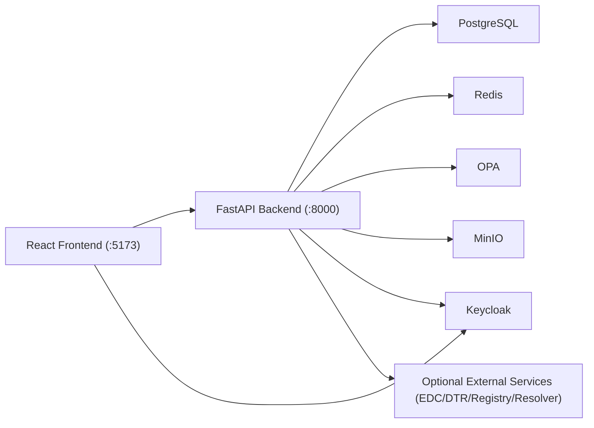

# Architecture

This document describes the current architecture implemented in the repository as of February 10, 2026.

## System Overview

The platform is a modular FastAPI backend with a React/Vite frontend, backed by Keycloak for identity, OPA for policy decisions, PostgreSQL for persistence, Redis for caching/rate limiting, and MinIO for object storage.

## Request Paths

### Authenticated Console Path

1. User signs in through Keycloak (OIDC).
2. Frontend sends bearer token to backend.
3. Backend validates token and applies tenant/role context.
4. Business modules enforce ABAC/RBAC and tenant scoping.
5. Data is read/written in PostgreSQL; supporting reads/writes go to Redis/MinIO as needed.

### Public Viewer Path

1. Public viewer routes are requested without login.
2. Backend public routers filter output to published/public-safe data.
3. Optional registry/resolver endpoints expose public descriptors and links.

## Backend Module Boundaries

| Domain | Module(s) | Primary Responsibility |
|---|---|---|
| Core DPP | `dpps`, `masters`, `templates` | DPP lifecycle, revisions, template resolution, master versioning |
| Tenant/Access | `tenants`, `policies`, `shares`, `onboarding` | Tenant membership, policy enforcement, onboarding and role requests |
| Publication/Exchange | `export`, `qr`, `connectors`, `registry`, `resolver`, `credentials` | Exports, data carriers, external connector flows, registry/discovery, VC endpoints |
| Compliance & Governance | `compliance`, `audit`, `activity` | Compliance checks, audit chain, activity streams |
| Supply Chain / Traceability | `epcis`, `digital_thread`, `lca` | EPCIS event capture/query, digital thread recording, LCA calculations |
| Platform Controls | `settings`, `webhooks` | Global settings and webhook subscriptions/deliveries |

## Frontend Feature Boundaries

| Feature Area | Location | Purpose |
|---|---|---|
| Auth | `src/auth` | OIDC login/callback and route guarding |
| Publisher Console | `src/features/publisher` | DPP list/editor flows, masters, batch import, data carriers |
| Dynamic Editor | `src/features/editor` | Template-driven form rendering, JSON toggle, qualifier enforcement |
| Admin | `src/features/admin` | Tenant management, settings, resolver/registry/credentials, webhooks, role requests |
| Viewer | `src/features/viewer` | Public DPP rendering and category sections |
| Compliance / Audit / Activity / EPCIS | `src/features/compliance`, `audit`, `activity`, `epcis` | Operational visibility and governance views |

## API Surface Shape

- Base API prefix: `/api/v1`
- Public routers include:
  - `/api/v1/public/...`
  - `/api/v1/resolve/...`
- Tenant-scoped routers follow:
  - `/api/v1/tenants/{tenant_slug}/...`
- Admin/global routers include examples such as:
  - `/api/v1/admin/settings/...`
  - `/api/v1/admin/audit/...`

## Data and Tenancy Model

- Multi-tenancy is implemented with tenant entities and tenant membership mappings.
- Tenant-scoped data models include `tenant_id` and are isolated by service-layer and DB-level controls.
- Migrations in `backend/app/db/migrations/versions/` show progressive capability additions, including:
  - multi-tenancy and RLS
  - compliance tables
  - EPCIS events and named queries
  - webhooks
  - resolver links
  - verifiable credentials
  - ownership/visibility access controls

## Feature Flags and Runtime Toggles

Selected config flags in `backend/app/core/config.py`:

| Variable | Default | Effect |
|---|---|---|
| `OPA_ENABLED` | `true` | Enables OPA-backed authorization checks |
| `COMPLIANCE_CHECK_ON_PUBLISH` | `false` | Enforces compliance gate on publish |
| `DIGITAL_THREAD_ENABLED` | `false` | Enables digital-thread event recording |
| `LCA_ENABLED` | `false` | Enables LCA/PCF services |
| `EPCIS_ENABLED` | `false` | Enables EPCIS capture/query features |
| `WEBHOOK_ENABLED` | `false` | Enables webhook delivery |
| `RESOLVER_ENABLED` | `false` | Enables GS1 resolver registration/serving |
| `REGISTRY_ENABLED` | `false` | Enables built-in registry operations |
| `VC_ENABLED` | `false` | Enables verifiable credentials features |

## Observability and Operational Signals

- Health endpoint: `/health`
- Metrics endpoint: `/metrics`
  - Unauthenticated in development when no metrics token is configured
  - Auth-gated or hidden in production depending on `METRICS_AUTH_TOKEN`
- CI workflows validate lint/test/security/build/docs/Helm quality gates.

## Related Docs

- Getting started: [`../getting-started/README.md`](../getting-started/README.md)
- Operations: [`../operations/README.md`](../operations/README.md)
- Public docs index: [`../README.md`](../README.md)
